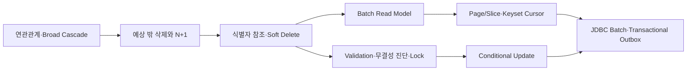
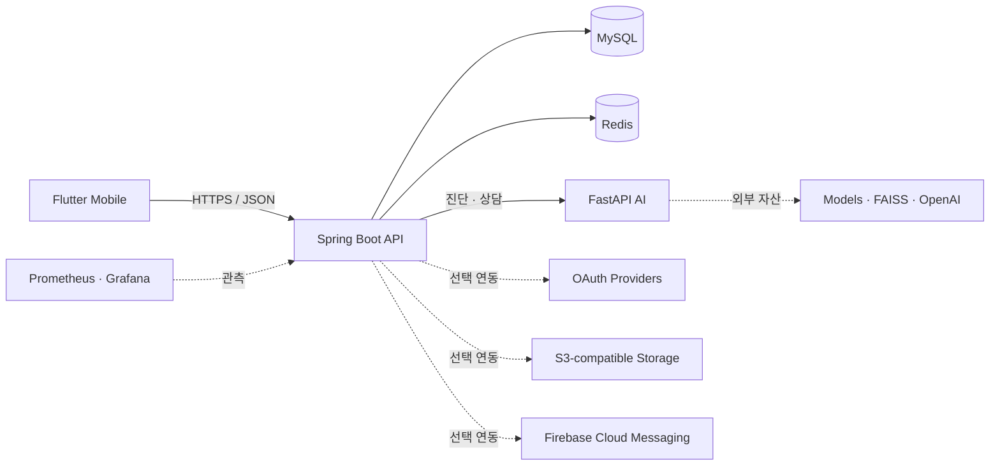

<p align="center">
  
</p>

<h1 align="center">GardenDoctor</h1>

<p align="center">
  식물 증상 진단부터 반려식물 관리, 재배 일지, 농장 탐색까지<br>
  하나의 흐름으로 연결한 AI 식물 관리 서비스
</p>

<p align="center">
  
  
  
  
  
  
</p>

<p align="center">
  <a href="#프로젝트-개요">프로젝트 개요</a> ·
  <a href="#담당-개발-범위">담당 범위</a> ·
  <a href="#backend-문제-해결과-정량-검증">문제 해결</a> ·
  <a href="#아키텍처">아키텍처</a> ·
  <a href="#빠른-시작">빠른 시작</a> ·
  <a href="#검증">검증</a>
</p>

## 프로젝트 개요

GardenDoctor(텃밭닥터)는 도시농업 입문자가 전문 지식 부족 때문에 겪는 진입장벽을 낮추기 위해 만든 AI 기반 식물 관리 모바일 서비스입니다. 사진 진단과 농업 상담을 일회성 답변으로 끝내지 않고, 작물 등록·재배 일지·관리 알림·주변 농장 탐색까지 파종에서 수확에 이르는 사용자 흐름으로 연결했습니다.

| 항목 | 내용 |
| --- | --- |
| 과정 | 제4기 K-Software Empowerment BootCamp(KSEB) 대학·기업 협력 프로젝트 |
| 개발 기간 | 2025년 7월 ~ 8월 |
| 팀 | Farming Family, 5명(기획 1 · Frontend 1 · Backend 2 · AI 1) |
| 제품 형태 | Flutter 앱 · Spring Boot API · FastAPI AI 서비스 |
| 공개 형태 | App·Backend·AI·Infra를 한 저장소에서 관리하는 재현 가능한 공개 모노레포 |

### 담당 개발 범위

- **Backend**: Spring Boot API, MySQL 데이터 모델링, Redis 세션·캐시, JWT 인증·인가, FastAPI 연동, 농촌진흥청 API 연동, Docker 실행 환경을 구현했습니다.
- **AI 챗봇**: FastAPI 서버, ReAct agent, 웹 검색·FAISS Vector DB·LLM 도구 연결, 전문 농업 데이터 벡터화, 대화 컨텍스트와 세션 흐름을 구현했습니다.
- **PM·설계**: 요구사항·기능 명세, ERD, API 문서, 시스템 아키텍처와 데이터 흐름을 작성하고 일정과 마일스톤을 관리했습니다.
- **리팩토링**: Backend 성능·정합성·동시성 문제를 재현 가능한 진단 테스트와 수치로 검증했습니다.

### 기술 스택

| 영역 | 기술 |
| --- | --- |
| Mobile | Flutter, Dart |
| Backend | Java 17, Spring Boot, Spring Security, JPA, MySQL, Redis |
| AI | Python, FastAPI, PyTorch, Hugging Face, FAISS, LangGraph |
| Infra·운영 | Docker Compose, AWS/S3-compatible Storage, Prometheus, Grafana, k6, GitHub Actions |
| 설계·협업 | Swagger/OpenAPI, Figma, Git, GitHub, Notion |

## 핵심 기능

| 사용자 경험 | 제공 기능 | 구성 요소 |
| --- | --- | --- |
| 식물 상태 확인 | 사진 업로드, AI 병해 진단, 진단 피드백 | Mobile · Backend · AI |
| 반려식물 관리 | 내 식물 등록·조회·수정·삭제, 식물 검색 | Mobile · Backend |
| 재배 기록 | 날짜별 일지 작성, 사진과 메모 관리, 상세 조회 | Mobile · Backend |
| AI 상담 | 대화 세션, 식물 관리 질의, 대화 기록 관리 | Mobile · Backend · AI |
| 주변 농장 탐색 | 농장 검색, 위치 기반 주변 농장 조회 | Mobile · Backend · Kakao |
| 사용자 경험 | 이메일·소셜 로그인, 프로필, 알림함 | Mobile · Backend · OAuth/FCM |
| 운영 지원 | 헬스체크, 메트릭, 대시보드, 부하 테스트 | Actuator · Prometheus · Grafana · k6 |

## Backend 문제 해결과 정량 검증

이 리팩토링은 처음부터 성능 수치를 만들기 위해 시작한 작업이 아닙니다. 1차 목표는 **생명주기가 다른 도메인을 강하게 묶고 있던 JPA 연관관계와 물리 FK를 정리하고, broad cascade에 의한 예측하지 못한 Hard Delete를 제거하는 것**이었습니다.

연결 row 삭제가 부모 Diary와 ImageFile까지 전파되는 문제를 재현한 뒤, cross-aggregate 객체 관계를 식별자 참조로 바꾸고 사용자·UserPlant·Plant·Farm에는 도메인별 Soft Delete를 적용했습니다. 이 과정에서 ORM과 DB가 맡던 정합성 책임이 애플리케이션으로 이동했고, 이를 참조 검증, 무결성 진단, shared/exclusive row lock으로 보완했습니다.

객체 그래프를 제거하자 DTO의 LAZY 순회로 발생하던 N+1이 명확하게 드러났습니다. 이를 batch read model로 바꾼 뒤에는 무제한 목록과 deep OFFSET, 대량 알림의 단건 transaction과 외부 FCM 장애 경계, Refresh Token 동시 재사용 문제까지 순서대로 확장해 해결했습니다.



### 정량 성과 요약

| 리팩토링 흐름 | 최종 선택 | 검증 결과 |
| --- | --- | --- |
| 연관관계와 삭제 정책 | cross-aggregate 식별자 참조 + 도메인별 Soft Delete + 명시적 삭제 | main entity 관계/cascade annotation **0개**, long-lived schema FK **16개 → fresh schema 0개**, 삭제 진단 **8/8 통과** |
| 관계 제거 후 N+1 | 페이지 조회 + 연결 ID·이미지 `IN` batch read model | Diary **6건 13 queries → 1건·30건 모두 3 queries**, 증가량 ≤ 1·전체 ≤ 5 회귀 조건 |
| deep OFFSET의 스캔 비용과 페이지 중복·누락 | `(created_at, diary_id)` 복합 keyset cursor | p95 **90.55 → 13.62ms(84.96% 감소·6.65배)**, p99 **98.20 → 17.64ms(82.04% 감소·5.57배)** |
| 식물 관리 알림의 단건 처리·동기 FCM·중복 실행 | user keyset + JDBC batch + Transactional Outbox + MySQL Named Lock(`GET_LOCK`)·DB unique key | 5,000건 DB 경로 **55.444초 → 1.009초(54.95배)**, 100,000건 pipeline **33.642초**, backlog **0** |
| raw Refresh Token 저장과 동시 재사용 | SHA-256 fingerprint + 조건부 1-row rotation | raw bearer token 미저장, 동시 재사용을 원자적으로 거부 |

### 알림 처리량 수치가 서로 다른 이유

5,000건과 100,000건 수치는 동일 로직에 데이터 크기만 바꾼 결과가 아닙니다.

| 측정 | 포함 범위 | 결과 |
| --- | --- | ---: |
| 5,000건 전후 비교 | 이미 선정된 user ID를 사용자별 5,000 transaction으로 저장 vs 1,000건 단위 5 transaction으로 batch 저장 | **55.444초 → 1.009초** |
| 100,000건 producer | keyset 대상 조회, 작업 조회·집계, Notification/Outbox 생성, 100 chunk commit | **9.609초**, 약 10,407건/초 |
| 100,000건 drain | 500건씩 200회 claim, mock FCM 결과, 완료 상태 transaction | **24.033초**, 약 4,161건/초 |

Outbox drain은 batch마다 claim과 completion을 별도 transaction으로 처리하고 수신 자격·상태·재시도 정보까지 갱신하므로 producer보다 처리량이 낮습니다. 과거 로컬 실행에서 관측된 294ms 등은 실행 시점과 경로가 다른 값이므로 최종 공개 수치와 섞지 않았습니다. FCM은 mock이어서 실제 Firebase network·quota를 포함하지 않으며, 모든 수치는 단일 WSL host의 로컬 회귀 기준이지 운영 SLO가 아닙니다.

문제 정의, 수정 전·후 코드, 대안 비교, 선택 이유, 측정 조건과 남은 한계는 [Backend Refactoring Portfolio](docs/backend-refactoring-portfolio.md)에 정리했습니다.

## 아키텍처



- Mobile은 Backend API만 호출합니다.
- Backend가 인증·권한·영속성·외부 연동과 AI 호출 경계를 소유합니다.
- AI는 모델이나 벡터 자산이 없어도 `degraded` 상태로 기동하며, 사용할 수 없는 기능은 명시적으로 503을 반환합니다.
- Compose의 공개 포트는 기본적으로 `127.0.0.1`에만 바인딩됩니다.

더 자세한 경계와 책임은 [System Context](docs/architecture/system-context.md)에서 확인할 수 있습니다.

## 저장소 구조

```text
gardendoctor-public/
├── apps/mobile/          # Flutter 앱
├── services/backend/     # Spring Boot API, MySQL/Redis, Outbox worker
├── services/ai/          # FastAPI 진단·챗 서비스
├── infra/                # Compose, 환경 계약, Dockerfile, 관측성, 부하 테스트
├── docs/                 # 아키텍처와 공개 자산 정책
└── scripts/              # 공개 안전 검사와 소스 진단
```

Backend는 별도 저장소의 검증된 `88aad81` snapshot에서 가져왔습니다. 과거 secret 이력이 공개 저장소에 섞이지 않도록 Git history는 합치지 않고 source commit만 [`services/backend/UPSTREAM_COMMIT`](services/backend/UPSTREAM_COMMIT)에 기록했습니다.

## 빠른 시작

### 1. 로컬 stack 실행

공개 예시값은 로컬 개발용 placeholder이며 실제 운영 credential이 아닙니다.

> 공개 클론만으로 Compose 기동, Backend 핵심 API, AI health, 테스트와 build를 재현할 수 있습니다. OAuth·지도·FCM·외부 AI처럼 자격 증명이 필요한 연동은 ignored `infra/.env`와 저장소 밖 자산을 준비한 로컬 환경에서만 활성화하며, 실제 키를 Git에 넣지 않습니다.

```bash
cp infra/.env.example infra/.env
make compose-check
make stack-up
make stack-smoke
```

종료할 때는 `make stack-down`을 사용합니다. named volume은 유지되므로 데이터 초기화 명령은 아닙니다.

| 서비스 | 로컬 주소 |
| --- | --- |
| Backend | `http://127.0.0.1:8080` |
| Backend readiness | `http://127.0.0.1:8080/actuator/health/readiness` |
| AI health | `http://127.0.0.1:8000/health` |

MySQL은 host `3307`/container `3306`, Redis는 host/container 모두 `6379`를 사용합니다. `ddl-auto=update`는 빈 로컬 DB를 위한 기본값이며 운영 정책이 아닙니다.

### 2. Mobile 실행

Mobile은 Docker 상시 서비스가 아니라 기기 또는 에뮬레이터에서 실행합니다. `app-config`는 `infra/.env`에서 앱에 공개 가능한 값만 골라 ignored `infra/generated/mobile/app.local.json`을 생성합니다. DB, JWT, AWS, OAuth secret은 앱에 전달하지 않습니다.

```bash
make app-config
make app-get
make app-generate
make app-check
make app-run
```

Android emulator에서는 `adb reverse tcp:8080 tcp:8080`으로 Compose Backend에 연결할 수 있습니다. 실제 기기나 release build에는 해당 기기에서 접근 가능한 HTTPS API URL이 필요합니다.

[`infra/config/mobile/public.json`](infra/config/mobile/public.json)은 의도적으로 유효하지 않은 API 주소와 빈 provider key를 사용합니다. 공개 APK는 안전한 build artifact이며 라이브 기능 데모 APK가 아닙니다.

### 3. 선택형 서비스

```bash
# Backend와 필수 의존성 stack 또는 AI 서비스 실행
make backend-up
make ai-up

# 관측성 profile
make observability-up

# 부하 테스트 profile
make loadtest-smoke
```

모든 환경변수 이름과 안전한 예시는 [`infra/.env.example`](infra/.env.example), 세부 운영 명령은 [`infra/README.md`](infra/README.md)를 참고하세요.

## Firebase 선택 연동

기본 stack은 Firebase와 실제 FCM 전송을 명시적으로 비활성화합니다. FCM 시연이 필요할 때만 service-account JSON을 **저장소 밖**에 두고 `infra/.env`의 `FIREBASE_SERVICE_ACCOUNT_HOST_PATH`에 그 절대경로를 설정합니다.

```bash
make firebase-check
make firebase-secret-check
make stack-up-firebase
```

[`infra/compose.firebase.yaml`](infra/compose.firebase.yaml)은 호스트 JSON을 컨테이너의 `/run/secrets/firebase-admin.json`에 read-only로 연결합니다. JSON 파일을 저장소나 `infra/` 안으로 복사하지 마세요.

## 하나의 환경변수 계약

- 공개 계약: `infra/.env.example`
- 실제 로컬 값: ignored `infra/.env`
- Mobile 투영 결과: ignored `infra/generated/mobile/app.local.json`
- 컨테이너 주입: `infra/compose.yaml`에서 서비스별 allowlist로 명시

App/Service 하위에 별도 `.env`를 만들지 않습니다. 실제 값은 README, Compose, `application.properties`에 복사하지 않고 `infra/.env`와 저장소 밖 secret·asset 경로에서만 관리합니다.

## 검증

```bash
make public-check     # secret·금지 자산 공개 여부
make backend-check    # Backend test + source diagnostics
make ai-syntax        # AI Python syntax
make app-check        # Flutter format + analyze + test
make verify           # 기본 통합 검증

# 정량 Backend 진단(MySQL·Redis 실행 및 integration DB password 필요)
cd services/backend && ./gradlew portfolioIntegrationDiagnostics
```

`portfolioIntegrationDiagnostics`는 N+1·batch·query plan 등 외부 MySQL/Redis가 필요한 포트폴리오 진단을 실행하며 `INTEGRATION_DATASOURCE_PASSWORD`를 로컬 환경에서 주입해야 합니다. `make verify-full`은 Mobile debug APK와 Backend JAR를 만들고 전체 Compose stack smoke test까지 수행합니다. 이 smoke test는 Backend readiness와 AI의 `ok` 또는 `degraded` 응답을 확인하며, 외부 연동이나 AI 추론 성공까지 보장하지는 않습니다.

## 공개·운영 경계

실제 `.env`, OAuth/AWS/Firebase credential, Firebase service-account JSON, 모바일 Firebase 설정, 모델 가중치, 원본 PDF, 학습·테스트 데이터, 런타임 DB는 저장소에 포함하지 않습니다. 자세한 기준은 [Public Asset Policy](docs/public-assets.md)를 따릅니다.

연락처가 포함된 농장 원본 Excel도 공개 대상에서 제외했습니다. 위치 기반 흐름 재현에는 실제 농장·운영자 정보를 나타내지 않는 합성 fixture 3건만 사용하며, `APP_INIT_SEED_DATA_ENABLED=true`일 때 로컬 DB에 적재됩니다.

단일 [`infra/compose.yaml`](infra/compose.yaml)은 로컬 개발과 단일 호스트 실행의 기반입니다. 인터넷 운영 전에는 TLS/reverse proxy, secret manager 또는 Docker secrets, DB migration, backup/restore, resource limit, log rotation을 별도로 검토해야 합니다. 공개 placeholder와 `ddl-auto=update`를 운영에 사용하지 마세요.

## License

별도 표기가 없는 **소스 코드**는 [MIT License](LICENSE)로 공개합니다. 저작권 표시는 `GardenDoctor (Farming Family) contributors`로 두며, 각 기여자가 권리를 보유한 부분에 적용됩니다.

프로젝트 이름·로고·앱 아이콘·`apps/mobile/assets/`의 이미지, 원본 데이터와 제3자 자료에는 MIT가 자동 적용되지 않으며 별도 허가나 원 권리자의 조건을 따라야 합니다. 구체적인 범위는 [Public Asset Policy](docs/public-assets.md)를 확인하세요.
