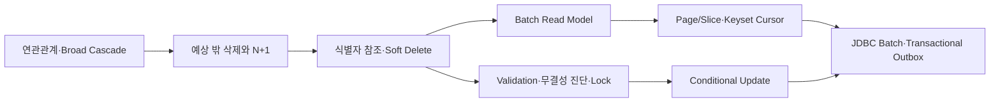
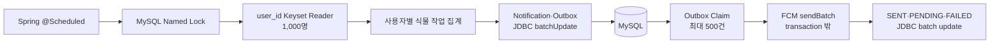
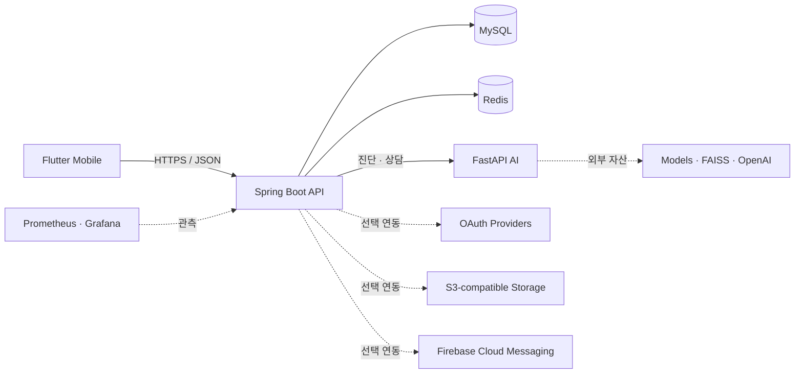

<p align="center">
  
</p>

<h1 align="center">GardenDoctor</h1>

<p align="center">
  식물 증상 진단부터 반려식물 관리, 재배 일지, 농장 탐색까지<br>
  하나의 흐름으로 연결한 AI 식물 관리 서비스
</p>

<p align="center">
  
  
  
  
  
  
</p>

<p align="center">
  <a href="#프로젝트-개요">프로젝트 개요</a> ·
  <a href="#담당-개발-범위">담당 범위</a> ·
  <a href="#리팩토링-및-문제-해결">문제 해결</a> ·
  <a href="#아키텍처">아키텍처</a> ·
  <a href="#빠른-시작">빠른 시작</a> ·
  <a href="#검증">검증</a>
</p>

## 프로젝트 개요

GardenDoctor(텃밭닥터)는 도시농업 입문자가 전문 지식 부족 때문에 겪는 진입장벽을 낮추기 위해 만든 AI 기반 식물 관리 모바일 서비스입니다. 사진 진단과 농업 상담을 일회성 답변으로 끝내지 않고, 작물 등록·재배 일지·관리 알림·주변 농장 탐색까지 파종에서 수확에 이르는 사용자 흐름으로 연결했습니다.

| 항목 | 내용 |
| --- | --- |
| 과정 | 제4기 K-Software Empowerment BootCamp(KSEB) 대학·기업 협력 프로젝트 |
| 개발 기간 | 2025년 7월 ~ 8월 |
| 팀 | Farming Family, 5명(기획 1 · Frontend 1 · Backend 2 · AI 1) |
| 제품 형태 | Flutter 앱 · Spring Boot API · FastAPI AI 서비스 |
| 공개 형태 | App·Backend·AI·Infra를 한 저장소에서 관리하는 재현 가능한 공개 모노레포 |

### 담당 개발 범위

- **Backend**: Spring Boot API, MySQL 데이터 모델링, Redis 세션·캐시, JWT 인증·인가, FastAPI 연동, 농촌진흥청 API 연동, Docker 실행 환경을 구현했습니다.
- **AI 챗봇**: FastAPI 서버, ReAct agent, 웹 검색·FAISS Vector DB·LLM 도구 연결, 전문 농업 데이터 벡터화, 대화 컨텍스트와 세션 흐름을 구현했습니다.
- **PM·설계**: 요구사항·기능 명세, ERD, API 문서, 시스템 아키텍처와 데이터 흐름을 작성하고 일정과 마일스톤을 관리했습니다.
- **리팩토링**: Backend 성능·정합성·동시성 문제를 재현 가능한 진단 테스트와 수치로 검증했습니다.

### 기술 스택

| 영역 | 기술 |
| --- | --- |
| Mobile | Flutter, Dart |
| Backend | Java 17, Spring Boot, Spring Security, JPA, MySQL, Redis |
| AI | Python, FastAPI, PyTorch, Hugging Face, FAISS, LangGraph |
| Infra·운영 | Docker Compose, AWS/S3-compatible Storage, Prometheus, Grafana, k6, GitHub Actions |
| 설계·협업 | Swagger/OpenAPI, Figma, Git, GitHub, Notion |

## 핵심 기능

| 사용자 경험 | 제공 기능 | 구성 요소 |
| --- | --- | --- |
| 식물 상태 확인 | 사진 업로드, AI 병해 진단, 진단 피드백 | Mobile · Backend · AI |
| 반려식물 관리 | 내 식물 등록·조회·수정·삭제, 식물 검색 | Mobile · Backend |
| 재배 기록 | 날짜별 일지 작성, 사진과 메모 관리, 상세 조회 | Mobile · Backend |
| AI 상담 | 대화 세션, 식물 관리 질의, 대화 기록 관리 | Mobile · Backend · AI |
| 주변 농장 탐색 | 농장 검색, 위치 기반 주변 농장 조회 | Mobile · Backend · Kakao |
| 사용자 경험 | 이메일·소셜 로그인, 프로필, 알림함 | Mobile · Backend · OAuth/FCM |
| 운영 지원 | 헬스체크, 메트릭, 대시보드, 부하 테스트 | Actuator · Prometheus · Grafana · k6 |

## 최종 산출물
https://github.com/KSEB-AI-3

## 리팩토링 및 문제 해결

이 리팩토링의 1차 목표는 **생명주기가 다른 도메인을 강하게 묶고 있던 JPA 연관관계와 물리 FK를 정리하고, broad cascade에 의한 예측하지 못한 Hard Delete를 제거하는 것**이었습니다.

연결 row 삭제가 부모 Diary와 ImageFile까지 전파되는 문제를 재현한 뒤, cross-aggregate 객체 관계를 식별자 참조로 바꾸고 사용자·UserPlant·Plant·Farm에는 도메인별 Soft Delete를 적용했습니다. 이 과정에서 ORM과 DB가 맡던 정합성 책임이 애플리케이션으로 이동했고, 이를 참조 검증, 무결성 진단, shared/exclusive row lock으로 보완했습니다.

연관관계를 제거하는 과정에서 DTO의 LAZY 객체 그래프 순회가 N+1의 원인임을 확인했습니다. 이후 필요한 데이터를 명시적인 batch read model로 조회하도록 변경했습니다. 이를 batch read model로 바꾼 뒤에는 무제한 목록과 deep OFFSET, 대량 알림의 단건 transaction과 외부 FCM 장애 경계, Refresh Token 동시 재사용 문제까지 순서대로 확장해 해결했습니다.

> **용어 구분:** 이 프로젝트는 Spring Batch 프레임워크를 사용하지 않습니다. 대량 알림은 Spring `@Scheduled`, 수동 keyset chunk, `JdbcTemplate.batchUpdate`, Transactional Outbox로 구현했습니다. 아래의 “batch”는 JDBC batch 또는 일정 크기로 나눈 묶음 처리를 의미합니다.



### 대표 문제 해결 — 식물 관리 알림의 I/O 증폭 제거

#### 1. 문제 정의

GardenDoctor는 매일 정해진 시각에 사용자의 식물 상태를 확인하고 물주기·가지치기·영양제 작업을 개인별 알림으로 생성합니다. 초기 구현은 기능적으로 동작했지만, 처리 대상이 늘면 한 건의 알림을 만들기 위한 DB 조회·SQL 실행·transaction·외부 FCM 호출이 사용자 수에 비례해 반복되는 구조였습니다.

```text
Scheduler
  -> DATEDIFF 조건으로 대상 UserPlant 조회
  -> OFFSET으로 다음 페이지 이동
  -> 사용자별 User 재조회
  -> Notification INSERT
  -> Outbox 조회·INSERT
  -> FCM 단건 전송
```

병목은 네트워크 I/O와 디스크 I/O 중 하나만 느린 문제가 아니었습니다. 작은 DB 왕복과 transaction, 외부 I/O를 사용자마다 반복해 전체 비용이 증폭되는 구조가 핵심 원인이었습니다. 이를 확인하기 위해 5,000건의 저장 경로를 전후 비교하고, 최종 구조는 100,000명의 개인화 알림 생성과 Outbox 소진까지 확장해 검증했습니다.

#### 2. 원인 분석

| 원인 | 기존 구조의 문제 |
| --- | --- |
| 계산형 조회 조건 | `DATEDIFF(CURRENT_DATE, last_date)`를 row마다 계산하여 일반 B-Tree 인덱스의 range scan을 활용하기 어려움 |
| OFFSET 페이지 이동 | 실행 중 탈퇴나 알림 설정 변경으로 대상 집합이 달라지면 뒤 페이지가 이동해 중복·누락 가능 |
| 사용자별 transaction | User 조회, Notification·Outbox 저장과 commit 횟수가 사용자 수에 비례해 증가 |
| JPA 단건 저장 | `saveAll()`도 IDENTITY 키 전략에서는 JDBC batch가 자동 보장되지 않고 entity materialization 비용이 남음 |
| 식물 단위 처리 | 한 사용자가 여러 식물을 보유하면 같은 사용자에게 관리 알림이 여러 건 생성될 수 있음 |
| 외부 호출 결합 | FCM 응답을 기다리는 동안 DB connection을 점유하고, DB commit과 푸시 성공 사이의 부분 실패를 복구하기 어려움 |
| 다중 인스턴스 | 각 인스턴스의 `@Scheduled`가 동시에 실행되면 같은 알림을 중복 생성할 수 있음 |

5,000건 비교에서는 외부 FCM을 제외하고 DB 저장 경로만 측정했습니다. 개선 전 경로는 미리 선정한 사용자 ID마다 User를 다시 조회하고 Notification과 Outbox를 저장해 총 5,000개 transaction을 실행했습니다. 따라서 이 비교는 “전체 알림 서비스의 최대 처리량”이 아니라 단건 transaction 반복을 JDBC batch로 바꾼 효과를 확인하는 진단입니다.

#### 3. 대안 도출 및 비교

| 대안 | 장점 | 한계 | 판단 |
| --- | --- | --- | --- |
| OFFSET + 사용자별 transaction 유지 | 변경 범위가 작음 | deep OFFSET, 대상 이동, SQL·commit 선형 증가 | 제외 |
| `@Async`로 FCM 호출 | scheduler thread와 외부 호출 분리 | 프로세스 종료 시 작업 유실, 재시도·처리 이력 부재 | 제외 |
| FCM Topic | 서버 fan-out 비용 감소 | 사용자별 식물명·작업 개인화와 수신자별 결과 추적 불가 | 공통 공지에만 적합 |
| Spring Batch | JobRepository, checkpoint, restart, retry·skip 제공 | FCM 중복과 DB·외부 시스템 정합성을 자동 해결하지 않으며 현재 범위에서는 운영 복잡도 증가 | checkpoint 요구 전까지 보류 |
| Kafka·RabbitMQ·SQS | backpressure, DLQ와 worker 수평 확장 | broker 운영과 DB-broker 사이의 추가 정합성 문제 | 현재 범위에서는 보류 |
| MySQL Outbox + keyset + JDBC batch | 기존 인프라 활용, 개인화·재시도·처리 결과 관리 가능 | DB queue와 polling worker 운영 필요 | **선택** |

Spring Batch를 도입하지 않은 이유는 당시 핵심 문제가 프레임워크 부재가 아니라 조회 방식, DB I/O 횟수, transaction 경계와 FCM 분리에 있었기 때문입니다. 이후 실패 지점 재시작과 영속 checkpoint 요구가 커지면 producer를 Spring Batch Job/Step으로 전환할 수 있지만, 외부 전송의 원자성과 멱등성을 위한 Outbox와 unique key는 그대로 필요합니다.

#### 4. 최종 해결책과 선택 이유



- 관리 예정일을 `next_watering_date`, `next_pruning_date`, `next_fertilizing_date`로 미리 계산해 각 `next_*_date <= :executionDate` 조건을 인덱스로 탐색할 수 있도록 변경했습니다.
- 사용자 ID를 기준으로 1,000명씩 keyset 조회해 OFFSET 이동과 대상 변경에 따른 누락 위험을 제거했습니다.
- 한 사용자의 여러 식물 작업을 개인화 payload 하나로 집계했습니다.
- Notification과 Outbox를 같은 transaction에서 JDBC batch로 저장했습니다.
- FCM 호출은 DB transaction 밖의 별도 worker에서 최대 500건씩 처리합니다.
- 일시 오류는 지수 백오프로 재시도하고, 잘못된 token 같은 영구 오류는 즉시 실패 처리합니다.
- MySQL Named Lock은 여러 scheduler의 동시 실행 시도를 줄이고 `finally`에서 해제합니다. `event_key` unique 제약은 재시작과 다중 실행에서도 실제 중복 저장을 막습니다.
- 정확성의 최종 방어선은 Named Lock이 아니라 DB unique key입니다.

Named Lock은 InnoDB의 record lock·gap lock·next-key lock과 다른 **세션 단위 advisory lock**입니다. 작업 동안 별도 DB connection 하나를 점유하는 비용이 있으므로 짧은 일일 job의 실행 조정에만 사용했고, connection pool에는 batch transaction용 여유를 남겼습니다. 성능 진단은 `UserPlantCareJobService`를 직접 실행하므로 이 Named Lock connection은 측정값에 포함하지 않았습니다.

#### 5. 실행 및 성과

각 수치는 포함 범위와 transaction 수가 다르므로 동일한 데이터 크기 비교로 해석하지 않았습니다. 시간은 읽기 쉬운 밀리초 단위로 통일하고 처리량을 함께 표기했습니다.

| 측정 | 포함 범위 | 결과 | 처리량 |
| --- | --- | ---: | ---: |
| 5,000건 개선 전 DB 경로 | 선정된 ID를 사용자별로 다시 조회하고 Notification·Outbox 저장, 5,000 transaction | **55,444ms** | 약 90건/초 |
| 5,000건 개선 후 DB 경로 | 같은 대상과 payload를 1,000건씩 JDBC batch 저장, 5 transaction | **1,009ms, 54.95배 단축** | 약 4,955건/초 |
| 100,000건 producer | keyset 조회, 작업 조회·집계, Notification·Outbox 생성, 100 chunk commit | **9,609ms** | 약 10,407건/초 |
| 100,000건 Outbox drain | 500건씩 200회 claim, mock FCM 결과, 완료 상태 갱신 | **24,033ms** | 약 4,161건/초 |
| 전체 DB pipeline | producer와 drain 순차 합계 | **33,642ms, backlog 0** | 약 2,972건/초 |

Outbox drain은 200개 batch마다 claim과 completion을 별도 transaction으로 처리하고 수신 자격·상태·재시도 정보까지 갱신하므로 producer보다 처리량이 낮습니다. 과거 로컬 실행에서 관측한 294ms 등은 실행 시점과 측정 경로가 다른 값이므로 최종 결과와 섞지 않았습니다.

5,000건 비교는 `executeBatch()` 호출만이 아니라 transaction commit까지 포함합니다. 다만 개선 전 경로를 먼저 실행한 단일 로컬 관측이므로 JIT, MySQL buffer pool과 host 부하의 영향을 받을 수 있습니다. 따라서 54.95배는 운영 처리량 보장이 아니라 해당 조건에서 관측한 개선 폭입니다.

100,000건 drain의 FCM은 in-memory mock입니다. 실제 Firebase network, quota, 429 응답과 재시도 지연은 포함하지 않습니다. 정확한 소요 시간을 테스트의 고정 합격 기준으로 사용하지 않고 다음 불변 조건을 회귀 테스트로 강제했습니다.

- 100,000명 모두 Notification·Outbox 생성
- producer 100개 chunk 처리
- Outbox 500건씩 200개 batch 처리
- 처리 후 `PENDING` backlog 0
- producer와 drain 각각 2분 미만

관련 구현은 [UserPlantCareJobService](services/backend/src/main/java/com/project/farming/domain/userplant/service/UserPlantCareJobService.java), [CareNotificationBatchWriter](services/backend/src/main/java/com/project/farming/domain/userplant/service/CareNotificationBatchWriter.java), [FcmOutboxProcessor](services/backend/src/main/java/com/project/farming/domain/notification/outbox/FcmOutboxProcessor.java), [알림 성능 통합 진단](services/backend/src/test/java/com/project/farming/domain/userplant/service/UserPlantCareBatchPerformanceIntegrationDiagnosticsTest.java)에서 확인할 수 있습니다.

### 전체 리팩토링 검증 요약

| 문제 | 최종 선택 | 검증 결과와 해석 범위 |
| --- | --- | --- |
| 객체 연관관계와 삭제 전파 | 식별자 참조 + 도메인별 Soft Delete + 명시적 삭제 | source diagnostic으로 main entity의 JPA 관계·cascade annotation **0개**를 강제하고, 삭제·이력 보존 정책을 **8개 Docker MySQL 시나리오**로 검증 |
| 물리 FK 제거 후 정합성 | 서비스 참조 검증 + 28개 무결성 진단 + 충돌별 row lock | long-lived 로컬 DB에서 과거 FK **16개**, fresh schema에서 **0개**를 관측. `16 → 0`은 운영 보장이 아닌 로컬 schema 진단 결과 |
| Diary N+1 | 페이지 조회 + 연결 ID·이미지 `IN` 일괄 조회 | 수정 전 6건에서 **13 queries**를 관측. 현재 회귀 테스트는 1건에서 30건으로 늘어도 query 증가량 ≤ 1, 전체 ≤ 5를 강제하며 최신 로컬 실행은 **3 → 3 queries** |
| Diary deep OFFSET | `(created_at, diary_id)` keyset cursor | 12만 행·offset 8만·20 req/s의 warm steady-state HTTP 비교에서 p95 **90.55 → 13.62ms(84.96% 감소)**, p99 **98.20 → 17.64ms(82.04% 감소)** |
| 대량 관리 알림 | user keyset + JDBC batch + Transactional Outbox | 5,000건 DB 경로 **55,444 → 1,009ms** 단일 관측, 100,000건 pipeline 처리 후 backlog **0** |
| Refresh Token 재사용 | SHA-256 fingerprint + 조건부 1-row rotation | raw token을 저장하지 않고, 동일 old token을 사용한 동시 2요청에서 **성공 1건·거부 1건**을 MySQL 통합 테스트로 검증 |

Keyset 수치는 인증, Spring Security, Controller, DTO 변환, JSON 응답과 로컬 Docker MySQL을 포함한 HTTP 지연시간입니다. 같은 deep page를 반복 조회한 warm steady-state 결과이며 운영 환경의 cold-cache latency나 SLO로 해석하지 않습니다. 공개 저장소에는 개별 k6 원본 결과 대신 [aggregate baseline](infra/loadtest/baselines/diary-read-local.json)을 보존했습니다.

문제 정의, 수정 전·후 코드, 대안 비교, 선택 이유, 테스트 설계와 남은 한계는 [Backend Refactoring Portfolio](docs/backend-refactoring-portfolio.md)에 정리했습니다.

## 아키텍처




## ERD


- Mobile은 Backend API만 호출합니다.
- Backend가 인증·권한·영속성·외부 연동과 AI 호출 경계를 소유합니다.
- AI는 모델이나 벡터 자산이 없어도 `degraded` 상태로 기동하며, 사용할 수 없는 기능은 명시적으로 503을 반환합니다.
- Compose의 공개 포트는 기본적으로 `127.0.0.1`에만 바인딩됩니다.

더 자세한 경계와 책임은 [System Context](docs/architecture/system-context.md)에서 확인할 수 있습니다.

## 저장소 구조

```text
gardendoctor-public/
├── apps/mobile/          # Flutter 앱
├── services/backend/     # Spring Boot API, MySQL/Redis, Outbox worker
├── services/ai/          # FastAPI 진단·챗 서비스
├── infra/                # Compose, 환경 계약, Dockerfile, 관측성, 부하 테스트
├── docs/                 # 아키텍처와 공개 자산 정책
└── scripts/              # 공개 안전 검사와 소스 진단
```

## 빠른 시작

### 로컬 실행

로컬 환경에서는 Docker Compose로 Backend, AI, MySQL, Redis를 함께 실행할 수 있습니다. 공개 설정에는 실제 API 키나 운영 자격 증명이 포함되지 않습니다.

```bash
cp infra/.env.example infra/.env
make compose-check
make stack-up
make stack-smoke
```

실행을 종료할 때는 다음 명령을 사용합니다.

```bash
make stack-down
```

전체 코드 검증은 다음 명령으로 실행합니다. Java 17, Python 3와 Flutter 개발 환경이 필요합니다.

```bash
make verify
```

Mobile 실행, Firebase 선택 연동, 관측성, 부하 테스트와 환경변수 설정은 [Infrastructure Guide](infra/README.md)를 참고하세요.

## 공개 범위

실제 `.env`, OAuth·AWS·Firebase 자격 증명, Firebase service-account JSON, 모델 가중치와 운영 데이터는 저장소에 포함하지 않습니다. 외부 자격 증명이 필요한 기능은 공개 설정에서 비활성화되며, 자세한 기준은 [Public Asset Policy](docs/public-assets.md)를 따릅니다.

## License

별도 표기가 없는 **소스 코드**는 [MIT License](LICENSE)로 공개합니다. 저작권 표시는 `GardenDoctor (Farming Family) contributors`로 두며, 각 기여자가 권리를 보유한 부분에 적용됩니다.

프로젝트 이름·로고·앱 아이콘·`apps/mobile/assets/`의 이미지, 원본 데이터와 제3자 자료에는 MIT가 자동 적용되지 않으며 별도 허가나 원 권리자의 조건을 따라야 합니다. 구체적인 범위는 [Public Asset Policy](docs/public-assets.md)를 확인하세요.
