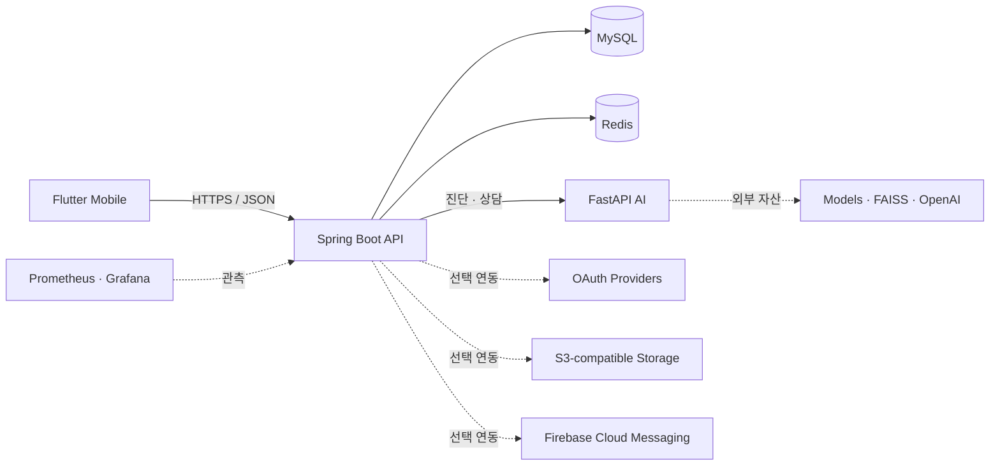

<p align="center">
  
</p>

<h1 align="center">GardenDoctor</h1>

<p align="center">
  식물 증상 진단부터 반려식물 관리, 재배 일지, 농장 탐색까지<br>
  하나의 흐름으로 연결한 AI 식물 관리 서비스
</p>

<p align="center">
  
  
  
  
  
  
</p>

<p align="center">
  <a href="#프로젝트-개요">프로젝트 개요</a> ·
  <a href="#담당-개발-범위">담당 범위</a> ·
  <a href="#backend-문제-해결과-정량-검증">문제 해결</a> ·
  <a href="#아키텍처">아키텍처</a> ·
  <a href="#빠른-시작">빠른 시작</a> ·
  <a href="#검증">검증</a>
</p>

## 프로젝트 개요

GardenDoctor(텃밭닥터)는 도시농업 입문자가 전문 지식 부족 때문에 겪는 진입장벽을 낮추기 위해 만든 AI 기반 식물 관리 모바일 서비스입니다. 사진 진단과 농업 상담을 일회성 답변으로 끝내지 않고, 작물 등록·재배 일지·관리 알림·주변 농장 탐색까지 파종에서 수확에 이르는 사용자 흐름으로 연결했습니다.

| 항목 | 내용 |
| --- | --- |
| 과정 | 제4기 K-Software Empowerment BootCamp(KSEB) 대학·기업 협력 프로젝트 |
| 개발 기간 | 2025년 7월 ~ 8월 |
| 팀 | Farming Family, 5명(기획 1 · Frontend 1 · Backend 2 · AI 1) |
| 제품 형태 | Flutter 앱 · Spring Boot API · FastAPI AI 서비스 |
| 공개 형태 | App·Backend·AI·Infra를 한 저장소에서 관리하는 재현 가능한 공개 모노레포 |

### 담당 개발 범위

- **Backend**: Spring Boot API, MySQL 데이터 모델링, Redis 세션·캐시, JWT 인증·인가, FastAPI 연동, 농촌진흥청 API 연동, Docker 실행 환경을 구현했습니다.
- **AI 챗봇**: FastAPI 서버, ReAct agent, 웹 검색·FAISS Vector DB·LLM 도구 연결, 전문 농업 데이터 벡터화, 대화 컨텍스트와 세션 흐름을 구현했습니다.
- **PM·설계**: 요구사항·기능 명세, ERD, API 문서, 시스템 아키텍처와 데이터 흐름을 작성하고 일정과 마일스톤을 관리했습니다.
- **공개 포트폴리오 고도화**: 분산된 실행 설정을 [`infra/`](infra/)로 통합하고, Backend 성능·정합성·동시성 문제를 재현 가능한 진단 테스트와 수치로 검증했습니다.

### 기술 스택

| 영역 | 기술 |
| --- | --- |
| Mobile | Flutter, Dart |
| Backend | Java 17, Spring Boot, Spring Security, JPA, MySQL, Redis |
| AI | Python, FastAPI, PyTorch, Hugging Face, FAISS, LangGraph |
| Infra·운영 | Docker Compose, AWS/S3-compatible Storage, Prometheus, Grafana, k6, GitHub Actions |
| 설계·협업 | Swagger/OpenAPI, Figma, Git, GitHub, Notion |

## 핵심 기능

| 사용자 경험 | 제공 기능 | 구성 요소 |
| --- | --- | --- |
| 식물 상태 확인 | 사진 업로드, AI 병해 진단, 진단 피드백 | Mobile · Backend · AI |
| 반려식물 관리 | 내 식물 등록·조회·수정·삭제, 식물 검색 | Mobile · Backend |
| 재배 기록 | 날짜별 일지 작성, 사진과 메모 관리, 상세 조회 | Mobile · Backend |
| AI 상담 | 대화 세션, 식물 관리 질의, 대화 기록 관리 | Mobile · Backend · AI |
| 주변 농장 탐색 | 농장 검색, 위치 기반 주변 농장 조회 | Mobile · Backend · Kakao |
| 사용자 경험 | 이메일·소셜 로그인, 프로필, 알림함 | Mobile · Backend · OAuth/FCM |
| 운영 지원 | 헬스체크, 메트릭, 대시보드, 부하 테스트 | Actuator · Prometheus · Grafana · k6 |

## Backend 문제 해결과 정량 검증

기능 구현 여부보다 **문제를 어떻게 정의하고, 원인을 어떤 근거로 좁혔으며, 대안을 비교해 무엇을 선택했고, 결과를 어떻게 검증했는지**가 드러나도록 정리했습니다. 수치는 모두 같은 로컬 회귀 조건에서 수정 전·후를 비교했으며 운영 환경의 SLO로 과장하지 않습니다.

### 정량 성과 요약

| 문제 | 최종 선택 | 검증 결과 |
| --- | --- | --- |
| 식물 관리 알림의 반복 조회·동기 FCM·중복 실행 | due-date cursor scan + JDBC batch + Transactional Outbox + MySQL advisory lock | 관측값: 5,000건 **39,774ms → 294ms(135.29배)**, 100,000건 생성 **17.52초**, 처리 **28.70초** · assertion: 100/200 batches, backlog **0** |
| 일지 목록 DTO 변환의 N+1 | 1:N fetch join 대신 ID·이미지 집합 조회 기반 3-query read model | 관측값: 일지 **1건과 30건 모두 3 queries** · regression guard: 증가량 ≤ 1, 전체 ≤ 5 queries |
| deep OFFSET의 스캔 비용과 페이지 중복·누락 | `(created_at, diary_id)` 복합 keyset cursor | p95 **90.55 → 13.62ms(84.96% 감소·6.65배)**, p99 **98.20 → 17.64ms(82.04% 감소·5.57배)** |
| raw Refresh Token 저장과 동시 재사용 | SHA-256 fingerprint + 조건부 1-row rotation | raw bearer token 미저장, 동시 재사용을 원자적으로 거부 |

### 대표 사례 — 식물 관리 알림 10만 건을 재시도 가능한 구조로 처리하기

#### 1. 문제 정의

초기 스케줄러는 모든 식물을 메모리에 올려 상태를 초기화하고, 물주기·가지치기·영양제 대상을 각각 조회했습니다. 대상마다 알림을 저장한 뒤 같은 트랜잭션 흐름에서 FCM을 동기 호출했기 때문에 데이터가 늘면 DB 작업과 외부 네트워크 지연이 함께 누적됐습니다. 다중 인스턴스가 같은 스케줄을 실행할 때 중복 알림을 막거나, FCM 실패 후 재처리할 방법도 필요했습니다.

#### 2. 원인 분석

- `DATEDIFF` 기반 조회 3개가 인덱스를 효율적으로 사용하기 어렵고 실행마다 전체 대상 범위를 반복 탐색했습니다.
- 사용자별 서비스 트랜잭션과 FCM 호출이 결합되어 처리량이 외부 API 응답 시간에 좌우됐습니다.
- 알림 저장 성공과 FCM 발송 실패 사이의 상태를 영속적으로 추적하지 않았습니다.
- 스케줄러 실행권과 알림의 멱등성을 보장하는 장치가 없었습니다.

#### 3. 해결책 도출 및 비교

| 대안 | 장점 | 한계 | 판단 |
| --- | --- | --- | --- |
| JPQL·인덱스만 최적화 | 변경 범위가 작음 | 동기 FCM, 재시도, 중복 실행 문제는 남음 | 부분 해결이라 제외 |
| `@Async`로 FCM 분리 | 요청 스레드를 빠르게 반환 | 프로세스 종료 시 작업 유실, DB commit과 발송의 원자성·재시도 이력 부족 | 제외 |
| Kafka/RabbitMQ 도입 | 높은 확장성과 내구성 | 짧은 프로젝트에 broker 운영·장애 지점이 추가됨 | 향후 확장안 |
| MySQL lock + JDBC batch + Transactional Outbox | 기존 MySQL 안에서 저장 원자성, 멱등성, 재시도와 batch 처리 확보 | MySQL 의존성과 worker 운영 필요 | **선정** |

#### 4. 최종 해결책 선정 및 이유

프로젝트 규모에서는 새로운 broker보다 이미 사용 중인 MySQL을 신뢰 가능한 경계로 삼는 편이 운영 복잡도 대비 효과가 컸습니다. `Notification`과 `FcmOutbox`를 한 트랜잭션에 기록하면 “알림은 저장됐지만 발송 작업은 사라지는” 구간을 없앨 수 있고, 별도 worker가 실패·재시도 상태를 관리할 수 있습니다. MySQL `GET_LOCK`과 event key unique 제약으로 중복 실행도 방어했습니다.

#### 5. 실행

1. 마지막 작업일 계산 대신 `next_*_date`를 저장하고 복합 인덱스를 추가했습니다.
2. 실행당 3개 대상 조회를 user ID cursor 기반 1개 due-date scan으로 통합했습니다.
3. `findAll + entity update` 초기화를 조건부 bulk `UPDATE` 1회로 변경했습니다.
4. 1,000명 단위 JDBC batch로 Notification과 Outbox를 함께 만들었습니다.
5. FCM worker가 500건씩 처리하고 최대 5회 재시도하도록 분리했습니다.

수정된 구조는 [`UserPlantCareJobService`](services/backend/src/main/java/com/project/farming/domain/userplant/service/UserPlantCareJobService.java), [`CareNotificationBatchWriter`](services/backend/src/main/java/com/project/farming/domain/userplant/service/CareNotificationBatchWriter.java), [`FcmOutboxProcessor`](services/backend/src/main/java/com/project/farming/domain/notification/outbox/FcmOutboxProcessor.java), [`MySqlAdvisoryLockService`](services/backend/src/main/java/com/project/farming/global/scheduling/MySqlAdvisoryLockService.java)에서 확인할 수 있습니다.

#### 6. 성과와 한계

- 5,000건 DB 기록: 사용자별 트랜잭션 **39,774ms → JDBC batch 294ms**, **135.29배**
- 100,000건 생성: **17.52초**, 5,707.76 users/s, 100 batches
- 100,000건 처리: **28.70초**, 3,484.93 rows/s, 200 batches
- 처리 전후 backlog: **100,000 → 0**, producer·worker 최대 active DB connection 각 1개
- 단, FCM은 mock이므로 실제 네트워크 지연·Firebase quota까지 검증한 운영 SLO는 아닙니다.

### 사례 2 — 일지 목록의 N+1을 고정 쿼리 read model로 전환

1. **문제 정의**: 일지 목록을 DTO로 변환할 때 연결 식물과 이미지 조회가 행마다 반복되어 목록 크기에 따라 쿼리가 늘어날 수 있었습니다.
2. **원인 분석**: 페이지 조회 이후 연관 정보를 개별 탐색하는 변환 흐름이 읽기 횟수를 데이터 행 수에 결합했습니다.
3. **대안 비교**: 1:N fetch join은 pagination 시 중복 행과 메모리 페이징 위험이 있고, batch fetch는 전역 ORM 설정에 성능이 의존합니다. 페이지 ID를 기준으로 필요한 관계를 집합 조회하는 read model은 쿼리 예산이 명확했습니다.
4. **선정·실행**: 일지 페이지 1회, `diaryId IN (...)` 연결 정보 1회, `imageId IN (...)` 이미지 1회로 조회하고 Map으로 조합했습니다. 구현은 [`DiaryService`](services/backend/src/main/java/com/project/farming/domain/diary/service/DiaryService.java)와 [`DiaryUserPlantRepository`](services/backend/src/main/java/com/project/farming/domain/diary/repository/DiaryUserPlantRepository.java)에 있습니다.
5. **성과**: 측정 당시 1건과 30건 모두 3 queries를 관측했습니다. [`DiaryNPlusOneIntegrationDiagnosticsTest`](services/backend/src/test/java/com/project/farming/integration/DiaryNPlusOneIntegrationDiagnosticsTest.java)는 환경 차이를 고려해 증가량 1 이하와 전체 5 queries 이하를 회귀 조건으로 검증합니다.

### 사례 3 — Deep OFFSET을 복합 Keyset Cursor로 전환

1. **문제 정의**: `OFFSET 80000`처럼 뒤쪽 페이지로 갈수록 앞선 행을 읽고 버리는 비용이 커졌고, 생성 시간이 같은 일지에서는 페이지 중복·누락 가능성이 있었습니다.
2. **원인 분석**: index를 추가해도 DB가 offset만큼 이동하는 비용은 남으며, `created_at` 하나만으로는 동일 timestamp의 순서를 확정할 수 없습니다.
3. **대안 비교**: OFFSET 유지는 임의 페이지 이동이 쉽지만 깊이에 비례해 느려지고, 단일 timestamp cursor는 동률을 처리하지 못합니다. `(created_at, diary_id)` tuple은 안정적인 전체 순서와 index range scan을 함께 제공합니다.
4. **선정·실행**: 최신순 복합 인덱스와 tuple 조건을 적용하고 [`CreatedAtIdCursorCodec`](services/backend/src/main/java/com/project/farming/global/pagination/CreatedAtIdCursorCodec.java)으로 두 값을 하나의 cursor 계약으로 캡슐화했습니다.
5. **성과**: 120,000행·offset 80,000·20 req/s 조건에서 p95 **90.55 → 13.62ms**(84.96% 감소·6.65배), p99 **98.20 → 17.64ms**(82.04% 감소·5.57배)를 기록했습니다. 원본 측정값은 [`diary-read-local.json`](infra/loadtest/baselines/diary-read-local.json)에 보관합니다.

### 사례 4 — Refresh Token 원문 저장과 동시 재사용 제거

1. **문제 정의**: DB에 raw Refresh Token을 저장하면 유출 시 bearer credential로 바로 악용될 수 있고, 같은 토큰의 동시 갱신 요청이 모두 성공할 가능성이 있었습니다.
2. **원인 분석**: 복호화 가능한 값의 저장과 조회 후 갱신하는 두 단계 흐름이 각각 노출 범위와 race condition을 만들었습니다.
3. **대안 비교**: 암호화 저장은 원문 복구가 가능해 키 관리가 추가되고, 비관적 lock은 요청 경합 동안 connection을 점유합니다. 복호화가 필요 없는 SHA-256 fingerprint와 조건부 단일 UPDATE는 노출 범위와 동시성 문제를 함께 줄입니다.
4. **선정·실행**: [`JwtTokenFingerprint`](services/backend/src/main/java/com/project/farming/global/jwtToken/JwtTokenFingerprint.java)로 64자 fingerprint만 저장하고, 기존 fingerprint가 일치할 때만 새 값으로 바꾸는 1-row rotation을 적용했습니다.
5. **성과**: [`RefreshTokenRotationIntegrationTest`](services/backend/src/test/java/com/project/farming/integration/RefreshTokenRotationIntegrationTest.java)가 raw token 부재와 동시 요청 결과 `(1, 0)`을 검증해 한 요청만 성공함을 보장합니다.

측정은 2026-07-13 단일 WSL host의 Spring Boot·Docker MySQL 8.4 환경에서 수행했습니다. 일지 성능은 120,000행, deep offset 80,000, page size 20, 20 req/s의 교대 3회 측정 중앙값이며, 5천 건 batch 비교는 단일 진단 실행입니다. **정확한 시간과 쿼리 수는 해당 실행의 관측값이며, 테스트 assertion은 환경 독립적인 batch 수·backlog·동시성 결과와 쿼리 상한을 검증합니다. 모든 수치는 로컬 회귀 기준이지 운영 SLO가 아닙니다.**

네 사례의 수정 전·후 코드, 대안별 기각 이유, 실행 순서와 검증 한계는 [GardenDoctor Backend · 문제 해결과 정량 검증](https://app.notion.com/p/39cce4340ea58185a417d1a382e0055c)에 정리했습니다. 재현 근거는 [`diary-read-local.json`](infra/loadtest/baselines/diary-read-local.json), [`DiaryNPlusOneIntegrationDiagnosticsTest`](services/backend/src/test/java/com/project/farming/integration/DiaryNPlusOneIntegrationDiagnosticsTest.java), [`UserPlantCareBatchPerformanceIntegrationDiagnosticsTest`](services/backend/src/test/java/com/project/farming/domain/userplant/service/UserPlantCareBatchPerformanceIntegrationDiagnosticsTest.java)에서 확인할 수 있습니다.

## 아키텍처



- Mobile은 Backend API만 호출합니다.
- Backend가 인증·권한·영속성·외부 연동과 AI 호출 경계를 소유합니다.
- AI는 모델이나 벡터 자산이 없어도 `degraded` 상태로 기동하며, 사용할 수 없는 기능은 명시적으로 503을 반환합니다.
- Compose의 공개 포트는 기본적으로 `127.0.0.1`에만 바인딩됩니다.

더 자세한 경계와 책임은 [System Context](docs/architecture/system-context.md)에서 확인할 수 있습니다.

## 저장소 구조

```text
gardendoctor-public/
├── apps/mobile/          # Flutter 앱
├── services/backend/     # Spring Boot API, MySQL/Redis, Outbox worker
├── services/ai/          # FastAPI 진단·챗 서비스
├── infra/                # Compose, 환경 계약, Dockerfile, 관측성, 부하 테스트
├── docs/                 # 아키텍처와 공개 자산 정책
└── scripts/              # 공개 안전 검사와 소스 진단
```

Backend는 별도 저장소의 검증된 `88aad81` snapshot에서 가져왔습니다. 과거 secret 이력이 공개 저장소에 섞이지 않도록 Git history는 합치지 않고 source commit만 [`services/backend/UPSTREAM_COMMIT`](services/backend/UPSTREAM_COMMIT)에 기록했습니다.

## 빠른 시작

### 1. 로컬 stack 실행

공개 예시값은 로컬 개발용 placeholder이며 실제 운영 credential이 아닙니다.

> 공개 클론만으로 Compose 기동, Backend 핵심 API, AI health, 테스트와 build를 재현할 수 있습니다. OAuth·지도·FCM·외부 AI처럼 자격 증명이 필요한 연동은 ignored `infra/.env`와 저장소 밖 자산을 준비한 로컬 환경에서만 활성화하며, 실제 키를 Git에 넣지 않습니다.

```bash
cp infra/.env.example infra/.env
make compose-check
make stack-up
make stack-smoke
```

종료할 때는 `make stack-down`을 사용합니다. named volume은 유지되므로 데이터 초기화 명령은 아닙니다.

| 서비스 | 로컬 주소 |
| --- | --- |
| Backend | `http://127.0.0.1:8080` |
| Backend readiness | `http://127.0.0.1:8080/actuator/health/readiness` |
| AI health | `http://127.0.0.1:8000/health` |

MySQL은 host `3307`/container `3306`, Redis는 host/container 모두 `6379`를 사용합니다. `ddl-auto=update`는 빈 로컬 DB를 위한 기본값이며 운영 정책이 아닙니다.

### 2. Mobile 실행

Mobile은 Docker 상시 서비스가 아니라 기기 또는 에뮬레이터에서 실행합니다. `app-config`는 `infra/.env`에서 앱에 공개 가능한 값만 골라 ignored `infra/generated/mobile/app.local.json`을 생성합니다. DB, JWT, AWS, OAuth secret은 앱에 전달하지 않습니다.

```bash
make app-config
make app-get
make app-generate
make app-check
make app-run
```

Android emulator에서는 `adb reverse tcp:8080 tcp:8080`으로 Compose Backend에 연결할 수 있습니다. 실제 기기나 release build에는 해당 기기에서 접근 가능한 HTTPS API URL이 필요합니다.

[`infra/config/mobile/public.json`](infra/config/mobile/public.json)은 의도적으로 유효하지 않은 API 주소와 빈 provider key를 사용합니다. 공개 APK는 안전한 build artifact이며 라이브 기능 데모 APK가 아닙니다.

### 3. 선택형 서비스

```bash
# Backend와 필수 의존성 stack 또는 AI 서비스 실행
make backend-up
make ai-up

# 관측성 profile
make observability-up

# 부하 테스트 profile
make loadtest-smoke
```

모든 환경변수 이름과 안전한 예시는 [`infra/.env.example`](infra/.env.example), 세부 운영 명령은 [`infra/README.md`](infra/README.md)를 참고하세요.

## Firebase 선택 연동

기본 stack은 Firebase와 실제 FCM 전송을 명시적으로 비활성화합니다. FCM 시연이 필요할 때만 service-account JSON을 **저장소 밖**에 두고 `infra/.env`의 `FIREBASE_SERVICE_ACCOUNT_HOST_PATH`에 그 절대경로를 설정합니다.

```bash
make firebase-check
make firebase-secret-check
make stack-up-firebase
```

[`infra/compose.firebase.yaml`](infra/compose.firebase.yaml)은 호스트 JSON을 컨테이너의 `/run/secrets/firebase-admin.json`에 read-only로 연결합니다. JSON 파일을 저장소나 `infra/` 안으로 복사하지 마세요.

## 하나의 환경변수 계약

- 공개 계약: `infra/.env.example`
- 실제 로컬 값: ignored `infra/.env`
- Mobile 투영 결과: ignored `infra/generated/mobile/app.local.json`
- 컨테이너 주입: `infra/compose.yaml`에서 서비스별 allowlist로 명시

App/Service 하위에 별도 `.env`를 만들지 않습니다. 실제 값은 README, Compose, `application.properties`에 복사하지 않고 `infra/.env`와 저장소 밖 secret·asset 경로에서만 관리합니다.

## 검증

```bash
make public-check     # secret·금지 자산 공개 여부
make backend-check    # Backend test + source diagnostics
make ai-syntax        # AI Python syntax
make app-check        # Flutter format + analyze + test
make verify           # 기본 통합 검증

# 정량 Backend 진단(MySQL·Redis 실행 및 integration DB password 필요)
cd services/backend && ./gradlew portfolioIntegrationDiagnostics
```

`portfolioIntegrationDiagnostics`는 N+1·batch·query plan 등 외부 MySQL/Redis가 필요한 포트폴리오 진단을 실행하며 `INTEGRATION_DATASOURCE_PASSWORD`를 로컬 환경에서 주입해야 합니다. `make verify-full`은 Mobile debug APK와 Backend JAR를 만들고 전체 Compose stack smoke test까지 수행합니다. 이 smoke test는 Backend readiness와 AI의 `ok` 또는 `degraded` 응답을 확인하며, 외부 연동이나 AI 추론 성공까지 보장하지는 않습니다.

## 공개·운영 경계

실제 `.env`, OAuth/AWS/Firebase credential, Firebase service-account JSON, 모바일 Firebase 설정, 모델 가중치, 원본 PDF, 학습·테스트 데이터, 런타임 DB는 저장소에 포함하지 않습니다. 자세한 기준은 [Public Asset Policy](docs/public-assets.md)를 따릅니다.

연락처가 포함된 농장 원본 Excel도 공개 대상에서 제외했습니다. 위치 기반 흐름 재현에는 실제 농장·운영자 정보를 나타내지 않는 합성 fixture 3건만 사용하며, `APP_INIT_SEED_DATA_ENABLED=true`일 때 로컬 DB에 적재됩니다.

단일 [`infra/compose.yaml`](infra/compose.yaml)은 로컬 개발과 단일 호스트 실행의 기반입니다. 인터넷 운영 전에는 TLS/reverse proxy, secret manager 또는 Docker secrets, DB migration, backup/restore, resource limit, log rotation을 별도로 검토해야 합니다. 공개 placeholder와 `ddl-auto=update`를 운영에 사용하지 마세요.

## License

별도 표기가 없는 **소스 코드**는 [MIT License](LICENSE)로 공개합니다. 저작권 표시는 `GardenDoctor (Farming Family) contributors`로 두며, 각 기여자가 권리를 보유한 부분에 적용됩니다.

프로젝트 이름·로고·앱 아이콘·`apps/mobile/assets/`의 이미지, 원본 데이터와 제3자 자료에는 MIT가 자동 적용되지 않으며 별도 허가나 원 권리자의 조건을 따라야 합니다. 구체적인 범위는 [Public Asset Policy](docs/public-assets.md)를 확인하세요.
