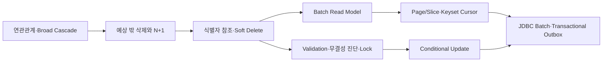
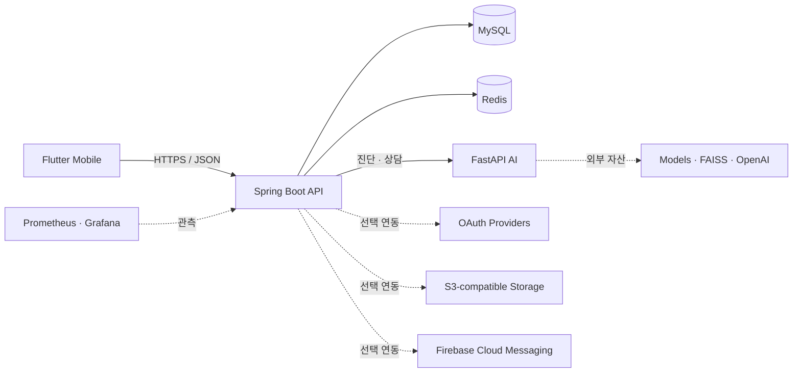

<p align="center">
  
</p>

<h1 align="center">GardenDoctor</h1>

<p align="center">
  식물 증상 진단부터 반려식물 관리, 재배 일지, 농장 탐색까지<br>
  하나의 흐름으로 연결한 AI 식물 관리 서비스
</p>

<p align="center">
  
  
  
  
  
  
</p>

<p align="center">
  <a href="#프로젝트-개요">프로젝트 개요</a> ·
  <a href="#담당-개발-범위">담당 범위</a> ·
  <a href="#backend-문제-해결과-정량-검증">문제 해결</a> ·
  <a href="#아키텍처">아키텍처</a> ·
  <a href="#빠른-시작">빠른 시작</a> ·
  <a href="#검증">검증</a>
</p>

## 프로젝트 개요

GardenDoctor(텃밭닥터)는 도시농업 입문자가 전문 지식 부족 때문에 겪는 진입장벽을 낮추기 위해 만든 AI 기반 식물 관리 모바일 서비스입니다. 사진 진단과 농업 상담을 일회성 답변으로 끝내지 않고, 작물 등록·재배 일지·관리 알림·주변 농장 탐색까지 파종에서 수확에 이르는 사용자 흐름으로 연결했습니다.

| 항목 | 내용 |
| --- | --- |
| 과정 | 제4기 K-Software Empowerment BootCamp(KSEB) 대학·기업 협력 프로젝트 |
| 개발 기간 | 2025년 7월 ~ 8월 |
| 팀 | Farming Family, 5명(기획 1 · Frontend 1 · Backend 2 · AI 1) |
| 제품 형태 | Flutter 앱 · Spring Boot API · FastAPI AI 서비스 |
| 공개 형태 | App·Backend·AI·Infra를 한 저장소에서 관리하는 재현 가능한 공개 모노레포 |

### 담당 개발 범위

- **Backend**: Spring Boot API, MySQL 데이터 모델링, Redis 세션·캐시, JWT 인증·인가, FastAPI 연동, 농촌진흥청 API 연동, Docker 실행 환경을 구현했습니다.
- **AI 챗봇**: FastAPI 서버, ReAct agent, 웹 검색·FAISS Vector DB·LLM 도구 연결, 전문 농업 데이터 벡터화, 대화 컨텍스트와 세션 흐름을 구현했습니다.
- **PM·설계**: 요구사항·기능 명세, ERD, API 문서, 시스템 아키텍처와 데이터 흐름을 작성하고 일정과 마일스톤을 관리했습니다.
- **리팩토링**: Backend 성능·정합성·동시성 문제를 재현 가능한 진단 테스트와 수치로 검증했습니다.

### 기술 스택

| 영역 | 기술 |
| --- | --- |
| Mobile | Flutter, Dart |
| Backend | Java 17, Spring Boot, Spring Security, JPA, MySQL, Redis |
| AI | Python, FastAPI, PyTorch, Hugging Face, FAISS, LangGraph |
| Infra·운영 | Docker Compose, AWS/S3-compatible Storage, Prometheus, Grafana, k6, GitHub Actions |
| 설계·협업 | Swagger/OpenAPI, Figma, Git, GitHub, Notion |

## 핵심 기능

| 사용자 경험 | 제공 기능 | 구성 요소 |
| --- | --- | --- |
| 식물 상태 확인 | 사진 업로드, AI 병해 진단, 진단 피드백 | Mobile · Backend · AI |
| 반려식물 관리 | 내 식물 등록·조회·수정·삭제, 식물 검색 | Mobile · Backend |
| 재배 기록 | 날짜별 일지 작성, 사진과 메모 관리, 상세 조회 | Mobile · Backend |
| AI 상담 | 대화 세션, 식물 관리 질의, 대화 기록 관리 | Mobile · Backend · AI |
| 주변 농장 탐색 | 농장 검색, 위치 기반 주변 농장 조회 | Mobile · Backend · Kakao |
| 사용자 경험 | 이메일·소셜 로그인, 프로필, 알림함 | Mobile · Backend · OAuth/FCM |
| 운영 지원 | 헬스체크, 메트릭, 대시보드, 부하 테스트 | Actuator · Prometheus · Grafana · k6 |

## 리팩토링 및 문제 해결

이 리팩토링의 1차 목표는 **생명주기가 다른 도메인을 강하게 묶고 있던 JPA 연관관계와 물리 FK를 정리하고, broad cascade에 의한 예측하지 못한 Hard Delete를 제거하는 것**이었습니다.

연결 row 삭제가 부모 Diary와 ImageFile까지 전파되는 문제를 재현한 뒤, cross-aggregate 객체 관계를 식별자 참조로 바꾸고 사용자·UserPlant·Plant·Farm에는 도메인별 Soft Delete를 적용했습니다. 이 과정에서 ORM과 DB가 맡던 정합성 책임이 애플리케이션으로 이동했고, 이를 참조 검증, 무결성 진단, shared/exclusive row lock으로 보완했습니다.

연관관계를 제거하는 과정에서 DTO의 LAZY 객체 그래프 순회가 N+1의 원인임을 확인했습니다. 이후 필요한 데이터를 명시적인 batch read model로 조회하도록 변경했습니다. 이를 batch read model로 바꾼 뒤에는 무제한 목록과 deep OFFSET, 대량 알림의 단건 transaction과 외부 FCM 장애 경계, Refresh Token 동시 재사용 문제까지 순서대로 확장해 해결했습니다.



### 정량적 성능 테스트 요약

| 리팩토링 흐름 | 최종 선택 | 검증 결과 |
| --- | --- | --- |
| 연관관계와 삭제 정책 | cross-aggregate 식별자 참조 + 도메인별 Soft Delete + 명시적 삭제 | main entity 관계/cascade annotation **0개**, long-lived schema FK **16개 → fresh schema 0개**, 삭제 진단 **8/8 통과** |
| 관계 제거 후 N+1 | 페이지 조회 + 연결 ID·이미지 `IN` batch read model | Diary **6건 13 queries → 1건·30건 모두 3 queries**, 증가량 ≤ 1·전체 ≤ 5 회귀 조건 |
| deep OFFSET의 스캔 비용과 페이지 중복·누락 | `(created_at, diary_id)` 복합 keyset cursor | p95 **90.55 → 13.62ms(84.96% 감소·6.65배)**, p99 **98.20 → 17.64ms(82.04% 감소·5.57배)** |
| 식물 관리 알림의 단건 처리·동기 FCM·중복 실행 | user keyset + JDBC batch + Transactional Outbox + MySQL Named Lock(`GET_LOCK`)·DB unique key | 5,000건 DB 경로 **55.444초 → 1.009초(54.95배)**, 100,000건 pipeline **33.642초**, backlog **0** |
| raw Refresh Token 저장과 동시 재사용 | SHA-256 fingerprint + 조건부 1-row rotation | raw bearer token 미저장, 동시 재사용을 원자적으로 거부 |

### 알림 처리량 수치가 서로 다른 이유

5,000건과 100,000건 수치는 동일 로직에 데이터 크기만 바꾼 결과가 아닙니다.

| 측정 | 포함 범위 | 결과 |
| --- | --- | ---: |
| 5,000건 전후 비교 | 이미 선정된 user ID를 사용자별 5,000 transaction으로 저장 vs 1,000건 단위 5 transaction으로 batch 저장 | **55.444초 → 1.009초** |
| 100,000건 producer | keyset 대상 조회, 작업 조회·집계, Notification/Outbox 생성, 100 chunk commit | **9.609초**, 약 10,407건/초 |
| 100,000건 drain | 500건씩 200회 claim, mock FCM 결과, 완료 상태 transaction | **24.033초**, 약 4,161건/초 |

Outbox drain은 batch마다 claim과 completion을 별도 transaction으로 처리하고 수신 자격·상태·재시도 정보까지 갱신하므로 producer보다 처리량이 낮습니다. 과거 로컬 실행에서 관측된 294ms 등은 실행 시점과 경로가 다른 값이므로 최종 공개 수치와 섞지 않았습니다. FCM은 mock이어서 실제 Firebase network·quota를 포함하지 않으며, 모든 수치는 단일 WSL host의 로컬 회귀 기준이지 운영 SLO가 아닙니다.

문제 정의, 수정 전·후 코드, 대안 비교, 선택 이유, 측정 조건과 남은 한계는 [Backend Refactoring Portfolio](docs/backend-refactoring-portfolio.md)에 정리했습니다.

## 아키텍처



## ERD


- Mobile은 Backend API만 호출합니다.
- Backend가 인증·권한·영속성·외부 연동과 AI 호출 경계를 소유합니다.
- AI는 모델이나 벡터 자산이 없어도 `degraded` 상태로 기동하며, 사용할 수 없는 기능은 명시적으로 503을 반환합니다.
- Compose의 공개 포트는 기본적으로 `127.0.0.1`에만 바인딩됩니다.

더 자세한 경계와 책임은 [System Context](docs/architecture/system-context.md)에서 확인할 수 있습니다.

## 저장소 구조

```text
gardendoctor-public/
├── apps/mobile/          # Flutter 앱
├── services/backend/     # Spring Boot API, MySQL/Redis, Outbox worker
├── services/ai/          # FastAPI 진단·챗 서비스
├── infra/                # Compose, 환경 계약, Dockerfile, 관측성, 부하 테스트
├── docs/                 # 아키텍처와 공개 자산 정책
└── scripts/              # 공개 안전 검사와 소스 진단
```

## 빠른 시작

  ## 로컬 실행

  로컬 환경에서는 Docker Compose로 Backend, AI, MySQL, Redis를 함께 실행할 수 있습니다. 공개 설정에는 실제 API 키나 운영 자격 증명이 포함되지 않습니다.

  ```bash
  cp infra/.env.example infra/.env
  make compose-check
  make stack-up
  make stack-smoke
  ```

  실행을 종료할 때는 다음 명령을 사용합니다.

  ```bash
  make stack-down
  ```

  전체 코드 검증은 다음 명령으로 실행합니다. Java 17, Python 3와 Flutter 개발 환경이 필요합니다.

  ```bash
  make verify
  ```

  Mobile 실행, Firebase 선택 연동, 관측성, 부하 테스트와 환경변수 설정은 [Infrastructure Guide](infra/README.md)를 참고하세요.

  ## 공개 범위

  실제 `.env`, OAuth·AWS·Firebase 자격 증명, Firebase service-account JSON, 모델 가중치와 운영 데이터는 저장소에 포함하지 않습니다. 외부 자격 증명이 필요한 기능은 공개 설정에서 비활성화되며, 자세한 기준은 [Public Asset Policy]
  (docs/public-assets.md)를 따릅니다.

## License

별도 표기가 없는 **소스 코드**는 [MIT License](LICENSE)로 공개합니다. 저작권 표시는 `GardenDoctor (Farming Family) contributors`로 두며, 각 기여자가 권리를 보유한 부분에 적용됩니다.

프로젝트 이름·로고·앱 아이콘·`apps/mobile/assets/`의 이미지, 원본 데이터와 제3자 자료에는 MIT가 자동 적용되지 않으며 별도 허가나 원 권리자의 조건을 따라야 합니다. 구체적인 범위는 [Public Asset Policy](docs/public-assets.md)를 확인하세요.
