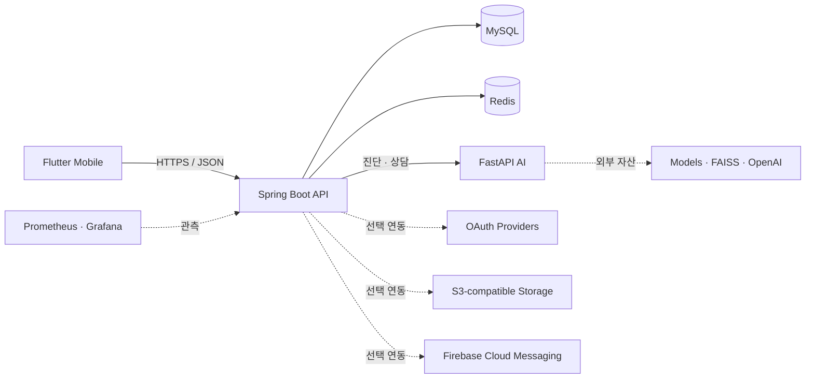

<p align="center">
  
</p>

<h1 align="center">GardenDoctor</h1>

<p align="center">
  식물 증상 진단부터 반려식물 관리, 재배 일지, 농장 탐색까지<br>
  하나의 흐름으로 연결한 AI 식물 관리 서비스
</p>

<p align="center">
  
  
  
  
  
  
</p>

<p align="center">
  <a href="#핵심-기능">핵심 기능</a> ·
  <a href="#backend-문제-해결과-정량-검증">문제 해결</a> ·
  <a href="#시연-가능-범위">시연 범위</a> ·
  <a href="#아키텍처">아키텍처</a> ·
  <a href="#빠른-시작">빠른 시작</a> ·
  <a href="#검증">검증</a>
</p>

## 프로젝트 소개

GardenDoctor는 Flutter 모바일 앱, Spring Boot API, FastAPI AI 서비스를 한 저장소에서 관리하는 공개 모노레포입니다. 사용자가 식물의 상태를 촬영하고 진단 결과를 확인한 뒤, 반려식물과 재배 일지를 지속해서 관리하는 경험을 중심으로 설계했습니다.

서버 실행 설정은 [`infra/`](infra/)에 모았습니다. 하나의 환경변수 계약에서 각 서비스에 필요한 값만 전달하며, 실제 자격 증명과 배포 전용 자산은 저장소 밖에 둡니다.

## 핵심 기능

| 사용자 경험 | 제공 기능 | 구성 요소 |
| --- | --- | --- |
| 식물 상태 확인 | 사진 업로드, AI 병해 진단, 진단 피드백 | Mobile · Backend · AI |
| 반려식물 관리 | 내 식물 등록·조회·수정·삭제, 식물 검색 | Mobile · Backend |
| 재배 기록 | 날짜별 일지 작성, 사진과 메모 관리, 상세 조회 | Mobile · Backend |
| AI 상담 | 대화 세션, 식물 관리 질의, 대화 기록 관리 | Mobile · Backend · AI |
| 주변 농장 탐색 | 농장 검색, 위치 기반 주변 농장 조회 | Mobile · Backend · Kakao |
| 사용자 경험 | 이메일·소셜 로그인, 프로필, 알림함 | Mobile · Backend · OAuth/FCM |
| 운영 지원 | 헬스체크, 메트릭, 대시보드, 부하 테스트 | Actuator · Prometheus · Grafana · k6 |

## Backend 문제 해결과 정량 검증

### 대표 사례 — 식물 관리 알림 10만 건을 재시도 가능한 구조로 처리하기

#### 1. 문제 정의

초기 스케줄러는 모든 식물을 메모리에 올려 상태를 초기화하고, 물주기·가지치기·영양제 대상을 각각 조회했습니다. 대상마다 알림을 저장한 뒤 같은 트랜잭션 흐름에서 FCM을 동기 호출했기 때문에 데이터가 늘면 DB 작업과 외부 네트워크 지연이 함께 누적됐습니다. 다중 인스턴스가 같은 스케줄을 실행할 때 중복 알림을 막거나, FCM 실패 후 재처리할 방법도 필요했습니다.

#### 2. 원인 분석

- `DATEDIFF` 기반 조회 3개가 인덱스를 효율적으로 사용하기 어렵고 실행마다 전체 대상 범위를 반복 탐색했습니다.
- 사용자별 서비스 트랜잭션과 FCM 호출이 결합되어 처리량이 외부 API 응답 시간에 좌우됐습니다.
- 알림 저장 성공과 FCM 발송 실패 사이의 상태를 영속적으로 추적하지 않았습니다.
- 스케줄러 실행권과 알림의 멱등성을 보장하는 장치가 없었습니다.

#### 3. 해결책 도출 및 비교

| 대안 | 장점 | 한계 | 판단 |
| --- | --- | --- | --- |
| JPQL·인덱스만 최적화 | 변경 범위가 작음 | 동기 FCM, 재시도, 중복 실행 문제는 남음 | 부분 해결이라 제외 |
| `@Async`로 FCM 분리 | 요청 스레드를 빠르게 반환 | 프로세스 종료 시 작업 유실, DB commit과 발송의 원자성·재시도 이력 부족 | 제외 |
| Kafka/RabbitMQ 도입 | 높은 확장성과 내구성 | 짧은 프로젝트에 broker 운영·장애 지점이 추가됨 | 향후 확장안 |
| MySQL lock + JDBC batch + Transactional Outbox | 기존 MySQL 안에서 저장 원자성, 멱등성, 재시도와 batch 처리 확보 | MySQL 의존성과 worker 운영 필요 | **선정** |

#### 4. 최종 해결책 선정 및 이유

프로젝트 규모에서는 새로운 broker보다 이미 사용 중인 MySQL을 신뢰 가능한 경계로 삼는 편이 운영 복잡도 대비 효과가 컸습니다. `Notification`과 `FcmOutbox`를 한 트랜잭션에 기록하면 “알림은 저장됐지만 발송 작업은 사라지는” 구간을 없앨 수 있고, 별도 worker가 실패·재시도 상태를 관리할 수 있습니다. MySQL `GET_LOCK`과 event key unique 제약으로 중복 실행도 방어했습니다.

#### 5. 실행

1. 마지막 작업일 계산 대신 `next_*_date`를 저장하고 복합 인덱스를 추가했습니다.
2. 실행당 3개 대상 조회를 user ID cursor 기반 1개 due-date scan으로 통합했습니다.
3. `findAll + entity update` 초기화를 조건부 bulk `UPDATE` 1회로 변경했습니다.
4. 1,000명 단위 JDBC batch로 Notification과 Outbox를 함께 만들었습니다.
5. FCM worker가 500건씩 처리하고 최대 5회 재시도하도록 분리했습니다.

#### 6. 성과와 한계

- 5,000건 DB 기록: 사용자별 트랜잭션 **39,774ms → JDBC batch 294ms**, **135.29배**
- 100,000건 생성: **17.52초**, 5,707.76 users/s, 100 batches
- 100,000건 처리: **28.70초**, 3,484.93 rows/s, 200 batches
- 처리 전후 backlog: **100,000 → 0**, producer·worker 최대 active DB connection 각 1개
- 단, FCM은 mock이므로 실제 네트워크 지연·Firebase quota까지 검증한 운영 SLO는 아닙니다.

### 다른 문제 해결 사례

| 문제 | 선택한 해결책과 이유 | 성과 |
| --- | --- | --- |
| 일지 DTO 변환 중 lazy loading으로 쿼리 수 증가 | 1:N fetch join의 pagination·중복 행 위험을 피하고, 연결 ID와 이미지를 집합 조회하는 3-query read model 선택 | 일지 **1건과 30건 모두 3 queries** |
| `OFFSET 80000`의 스캔 비용과 페이지 중복·누락 | index만 추가하면 deep scan이 남으므로 `(created_at, diary_id)` keyset cursor 선택 | p95 **90.55 → 13.62ms**(84.96% 감소·6.65배), p99 **98.20 → 17.64ms**(82.04% 감소·5.57배) |
| raw Refresh Token 저장과 동시 재사용 | 암호화보다 복호화할 필요 없는 SHA-256 fingerprint와 조건부 1-row rotation 선택 | DB에 raw bearer token을 남기지 않고 재사용 충돌을 원자적으로 거부 |

측정은 2026-07-13 단일 WSL host의 Spring Boot·Docker MySQL 8.4 환경에서 수행했습니다. 일지 성능은 120,000행, deep offset 80,000, page size 20, 20 req/s의 교대 3회 측정 중앙값이며, 5천 건 batch 비교는 단일 진단 실행입니다. **모든 수치는 로컬 회귀 기준이지 운영 SLO가 아닙니다.**

네 사례의 수정 전·후 코드, 대안별 기각 이유, 실행 순서와 검증 한계는 [GardenDoctor Backend · 문제 해결과 정량 검증](https://app.notion.com/p/39cce4340ea58185a417d1a382e0055c)에 정리했습니다. 재현 근거는 [`diary-read-local.json`](infra/loadtest/baselines/diary-read-local.json), [`DiaryNPlusOneIntegrationDiagnosticsTest`](services/backend/src/test/java/com/project/farming/integration/DiaryNPlusOneIntegrationDiagnosticsTest.java), [`UserPlantCareBatchPerformanceIntegrationDiagnosticsTest`](services/backend/src/test/java/com/project/farming/domain/userplant/service/UserPlantCareBatchPerformanceIntegrationDiagnosticsTest.java)에서 확인할 수 있습니다.

## 시연 가능 범위

**실제 API 키를 README나 Git에 넣지 않아도 시연할 수 있습니다.** 다만 키와 외부 AI 자산이 전혀 없는 공개 클론에서는 핵심 로컬 흐름만 재현할 수 있고, 모든 외부 연동을 포함한 완전한 실시간 시연은 불가능합니다.

| 시연 방식 | 가능한 범위 | 제한 |
| --- | --- | --- |
| 공개 클론 | 전체 인프라 기동, Backend 헬스체크, 로컬 DB 기반 핵심 API, AI 상태 확인 | AI는 자산이 없으면 `degraded`; OAuth·지도·FCM·외부 저장소 기능은 제한 |
| 로컬 비공개 시연 | ignored `infra/.env`와 저장소 밖 자산을 사용한 앱–서버 통합 시연 | 시연자 장비에 키와 모델 자산 준비 필요 |
| 영상·스크린샷 | 키를 공개하지 않고 전체 사용자 흐름 전달 | 실시간 체험은 아니며 민감 정보 마스킹 필요 |
| 인터넷 운영 | 이 저장소의 공개 기본값만으로는 제공하지 않음 | TLS, secret manager, 백업, 배포 정책을 별도로 구성해야 함 |

포트폴리오 공개에는 **공개 클론의 재현 가능한 축소 모드 + 비공개 로컬 환경에서 촬영한 짧은 데모 영상** 조합을 권장합니다. 리뷰어에게 실제 키나 `.env`를 전달할 필요는 없습니다.

### 기능별 추가 준비물

| 기능 | 추가로 필요한 비공개 설정 또는 자산 | 키가 없을 때 |
| --- | --- | --- |
| AI 사진 진단 | 승인된 모델 파일과 `AI_MODEL_HOST_DIR` | AI health는 확인 가능, 진단 요청은 503 |
| AI 챗봇 | `OPENAI_API_KEY`, `TAVILY_API_KEY`, FAISS 인덱스와 embedding 자산 | 챗 기능 비활성 |
| Kakao 로그인·지도 | Backend 및 Mobile용 Kakao 키 | 이메일 로그인과 비지도 화면 중심으로 시연 |
| 소셜 로그인 | 각 OAuth provider client 설정 | 이메일 인증 흐름 사용 |
| FCM 푸시 | 저장소 밖 Firebase service-account JSON과 Mobile Firebase 설정 | 알림 저장·조회는 가능, 실제 push 전송은 비활성 |
| 외부 이미지 저장 | 유효한 S3 호환 자격 증명과 bucket | 외부 업로드가 필요한 흐름 제한 |

## 아키텍처



- Mobile은 Backend API만 호출합니다.
- Backend가 인증·권한·영속성·외부 연동과 AI 호출 경계를 소유합니다.
- AI는 모델이나 벡터 자산이 없어도 `degraded` 상태로 기동하며, 사용할 수 없는 기능은 명시적으로 503을 반환합니다.
- Compose의 공개 포트는 기본적으로 `127.0.0.1`에만 바인딩됩니다.

더 자세한 경계와 책임은 [System Context](docs/architecture/system-context.md)에서 확인할 수 있습니다.

## 저장소 구조

```text
gardendoctor-public/
├── apps/mobile/          # Flutter 앱
├── services/backend/     # Spring Boot API, MySQL/Redis, Outbox worker
├── services/ai/          # FastAPI 진단·챗 서비스
├── infra/                # Compose, 환경 계약, Dockerfile, 관측성, 부하 테스트
├── docs/                 # 아키텍처와 공개 자산 정책
└── scripts/              # 공개 안전 검사와 소스 진단
```

Backend는 별도 저장소의 검증된 `88aad81` snapshot에서 가져왔습니다. 과거 secret 이력이 공개 저장소에 섞이지 않도록 Git history는 합치지 않고 source commit만 [`services/backend/UPSTREAM_COMMIT`](services/backend/UPSTREAM_COMMIT)에 기록했습니다.

## 빠른 시작

### 1. 로컬 stack 실행

공개 예시값은 로컬 개발용 placeholder이며 실제 운영 credential이 아닙니다.

```bash
cp infra/.env.example infra/.env
make compose-check
make stack-up
make stack-smoke
```

종료할 때는 `make stack-down`을 사용합니다. named volume은 유지되므로 데이터 초기화 명령은 아닙니다.

| 서비스 | 로컬 주소 |
| --- | --- |
| Backend | `http://127.0.0.1:8080` |
| Backend readiness | `http://127.0.0.1:8080/actuator/health/readiness` |
| AI health | `http://127.0.0.1:8000/health` |

MySQL은 host `3307`/container `3306`, Redis는 host/container 모두 `6379`를 사용합니다. `ddl-auto=update`는 빈 로컬 DB를 위한 기본값이며 운영 정책이 아닙니다.

### 2. Mobile 실행

Mobile은 Docker 상시 서비스가 아니라 기기 또는 에뮬레이터에서 실행합니다. `app-config`는 `infra/.env`에서 앱에 공개 가능한 값만 골라 ignored `infra/generated/mobile/app.local.json`을 생성합니다. DB, JWT, AWS, OAuth secret은 앱에 전달하지 않습니다.

```bash
make app-config
make app-get
make app-generate
make app-check
make app-run
```

Android emulator에서는 `adb reverse tcp:8080 tcp:8080`으로 Compose Backend에 연결할 수 있습니다. 실제 기기나 release build에는 해당 기기에서 접근 가능한 HTTPS API URL이 필요합니다.

[`infra/config/mobile/public.json`](infra/config/mobile/public.json)은 의도적으로 유효하지 않은 API 주소와 빈 provider key를 사용합니다. 공개 APK는 안전한 build artifact이며 라이브 기능 데모 APK가 아닙니다.

### 3. 선택형 서비스

```bash
# Backend와 필수 의존성 stack 또는 AI 서비스 실행
make backend-up
make ai-up

# 관측성 profile
make observability-up

# 부하 테스트 profile
make loadtest-smoke
```

모든 환경변수 이름과 안전한 예시는 [`infra/.env.example`](infra/.env.example), 세부 운영 명령은 [`infra/README.md`](infra/README.md)를 참고하세요.

## Firebase 선택 연동

기본 stack은 Firebase와 실제 FCM 전송을 명시적으로 비활성화합니다. FCM 시연이 필요할 때만 service-account JSON을 **저장소 밖**에 두고 `infra/.env`의 `FIREBASE_SERVICE_ACCOUNT_HOST_PATH`에 그 절대경로를 설정합니다.

```bash
make firebase-check
make firebase-secret-check
make stack-up-firebase
```

[`infra/compose.firebase.yaml`](infra/compose.firebase.yaml)은 호스트 JSON을 컨테이너의 `/run/secrets/firebase-admin.json`에 read-only로 연결합니다. JSON 파일을 저장소나 `infra/` 안으로 복사하지 마세요.

## 하나의 환경변수 계약

- 공개 계약: `infra/.env.example`
- 실제 로컬 값: ignored `infra/.env`
- Mobile 투영 결과: ignored `infra/generated/mobile/app.local.json`
- 컨테이너 주입: `infra/compose.yaml`에서 서비스별 allowlist로 명시

App/Service 하위에 별도 `.env`를 만들지 않습니다. 실제 값은 README, Compose, `application.properties`에 복사하지 않고 `infra/.env`와 저장소 밖 secret·asset 경로에서만 관리합니다.

## 검증

```bash
make public-check     # secret·금지 자산 공개 여부
make backend-check    # Backend test + source diagnostics
make ai-syntax        # AI Python syntax
make app-check        # Flutter format + analyze + test
make verify           # 기본 통합 검증
```

`make verify-full`은 Mobile debug APK와 Backend JAR를 만들고 전체 Compose stack smoke test까지 수행합니다. 이 smoke test는 Backend readiness와 AI의 `ok` 또는 `degraded` 응답을 확인하며, 외부 연동이나 AI 추론 성공까지 보장하지는 않습니다.

## 공개·운영 경계

실제 `.env`, OAuth/AWS/Firebase credential, Firebase service-account JSON, 모바일 Firebase 설정, 모델 가중치, 원본 PDF, 학습·테스트 데이터, 런타임 DB는 저장소에 포함하지 않습니다. 자세한 기준은 [Public Asset Policy](docs/public-assets.md)를 따릅니다.

연락처가 포함된 농장 원본 Excel도 공개 대상에서 제외했습니다. 위치 기반 흐름 재현에는 실제 농장·운영자 정보를 나타내지 않는 합성 fixture 3건만 사용하며, `APP_INIT_SEED_DATA_ENABLED=true`일 때 로컬 DB에 적재됩니다.

단일 [`infra/compose.yaml`](infra/compose.yaml)은 로컬 개발과 단일 호스트 실행의 기반입니다. 인터넷 운영 전에는 TLS/reverse proxy, secret manager 또는 Docker secrets, DB migration, backup/restore, resource limit, log rotation을 별도로 검토해야 합니다. 공개 placeholder와 `ddl-auto=update`를 운영에 사용하지 마세요.

## License

라이선스는 아직 선택되지 않았습니다. 저장소가 공개되더라도 LICENSE 파일이 추가되기 전에는 별도의 재사용 권한이 부여되지 않습니다.
