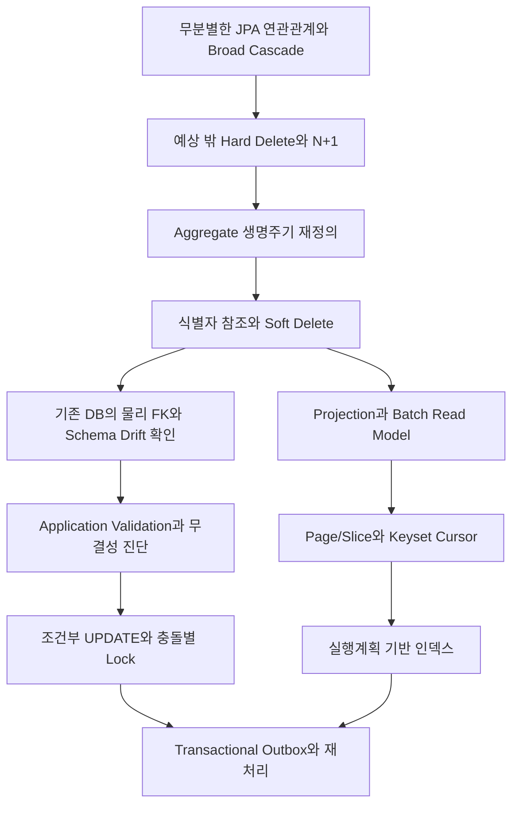

# GardenDoctor Backend Refactoring Portfolio

> GardenDoctor 원본은 5인 팀 프로젝트입니다. 이 문서는 원본 서비스 전체를 개인 결과물로 주장하지 않으며, 이후 개인적으로 수행한 Backend 구조 진단, 리팩토링, 테스트 설계와 정량 검증 범위만 다룹니다.

## 1. 리팩토링을 시작한 이유

처음부터 대규모 알림이나 성능 개선을 목표로 시작한 작업은 아니었습니다. 1차 목표는 **생명주기가 다른 도메인을 강하게 묶고 있던 JPA 연관관계와 물리 FK를 정리하여, 예측하기 어려운 삭제 전파를 제거하는 것**이었습니다.

기존 구조에서는 다음 두 증상이 함께 나타났습니다.

- `DiaryUserPlant` 같은 연결 row를 삭제했는데 `CascadeType.REMOVE`가 부모 `Diary`까지 전파됐습니다.
- Diary 목록 6건을 조회했을 때 DTO가 LAZY 객체 그래프를 순회하면서 SQL이 13회 발생했습니다.

처음에는 삭제 문제와 N+1 문제가 별개처럼 보였습니다. 하지만 두 문제의 공통 원인은 생명주기가 다른 aggregate를 객체 관계로 연결하고, 삭제와 조회 로직이 그 객체 그래프를 암묵적으로 따라가는 구조였습니다.

따라서 cascade 하나를 지우거나 fetch join 하나를 추가하는 데서 끝내지 않고, 다음 순서로 책임의 경계를 다시 설계했습니다.



이 리팩토링의 핵심은 특정 기술을 도입한 것이 아니라, ORM과 DB에 암묵적으로 맡겨 두었던 **삭제, 조회, 정합성, 동시성, 외부 side effect의 책임을 명시적인 코드와 검증으로 옮긴 것**입니다.

## 2. 리팩토링 전체 흐름

| 단계 | 발견한 문제 | 선택한 해결책 | 새로 맡게 된 책임 |
| --- | --- | --- | --- |
| 1 | 연결 row 삭제가 부모까지 전파되고 회원 Hard Delete가 이력을 제거 | Broad cascade 제거, 사용자·도메인 데이터 Soft Delete | 조회마다 active 조건과 보존 정책 필요 |
| 2 | cross-aggregate 객체 그래프가 생명주기와 삭제 순서를 숨김 | JPA 관계를 `userId`, `plantId`, `imageFileId` 등 식별자 참조로 전환 | 참조 존재와 소유권을 서비스에서 검증 |
| 3 | 관계 제거 후 기존 DB에 과거 FK가 남아 있음 | live schema inventory와 fresh schema 재생성 검증 | 운영 DB에는 명시적 migration 필요 |
| 4 | 물리 FK가 막던 orphan과 삭제 경쟁 조건이 노출 | 무결성 진단, shared/exclusive row lock, Soft Delete | 락 순서와 monitor 운영 필요 |
| 5 | DTO가 더 이상 객체 그래프를 탐색할 수 없음 | Projection과 `IN` batch read model | 조립 코드와 query budget 관리 필요 |
| 6 | N+1 제거 후에도 무제한 목록과 deep OFFSET 비용이 남음 | 최대 size 100, Page/Slice, Keyset Cursor | 임의 페이지 이동 제한과 cursor 계약 필요 |
| 7 | DB 내부 병목을 줄이자 외부 FCM과 동시 실행 위험이 드러남 | JDBC batch, Transactional Outbox, MySQL Named Lock | eventual consistency와 worker 운영 필요 |

## 3. 1단계 — 연관관계와 삭제 정책 재설계

### 문제 정의

기존 모델에는 child-to-parent `CascadeType.REMOVE`, 사용자에서 여러 도메인으로 뻗는 broad collection cascade, cross-aggregate `ManyToOne`이 함께 존재했습니다. 이 구조에서는 코드 한 줄의 `delete()`가 어느 데이터까지 제거하는지 service layer만 보고 판단하기 어려웠습니다.

특히 다음 데이터는 생명주기가 달랐습니다.

- 사용자는 탈퇴할 수 있지만 과거 Diary 이력은 보존할 수 있어야 합니다.
- UserPlant는 현재 관리 목록에서는 제거되더라도 과거 Diary와의 연결 이력은 남아야 합니다.
- ImageFile metadata와 실제 S3 객체는 DB transaction 하나로 원자적으로 삭제할 수 없습니다.
- Refresh Token처럼 보안상 즉시 폐기해야 하는 운영 데이터는 이력 데이터와 정책이 다릅니다.

따라서 모든 데이터를 일괄 Hard Delete하거나 모든 데이터를 Soft Delete하는 방식 모두 도메인 생명주기를 정확히 표현하지 못했습니다.

### 수정 전

연결 엔티티가 부모 객체를 직접 참조하면서 child 삭제가 부모 삭제로 전파될 수 있었습니다.

```java
@ManyToOne(fetch = FetchType.LAZY, cascade = CascadeType.REMOVE)
@JoinColumn(name = "diary_id", nullable = false)
private Diary diary;

@ManyToOne(fetch = FetchType.LAZY)
@JoinColumn(name = "user_plant_id", nullable = false)
private UserPlant userPlant;
```

### 대안 비교

| 대안 | 장점 | 한계 | 판단 |
| --- | --- | --- | --- |
| 위험한 cascade만 제거 | 변경 범위가 작음 | 객체 그래프, LAZY 순회와 삭제 책임 혼재가 남음 | 부분 해결 |
| 단방향 관계만 유지 | 객체 탐색이 편리함 | 생명주기와 FK lock 결합이 계속됨 | 제외 |
| 모든 데이터 Hard Delete | 조회 조건이 단순함 | 이력 유실과 참조 충돌 위험 | 제외 |
| 식별자 참조 + 도메인별 Soft Delete | aggregate 경계와 삭제 책임이 명확함 | DB FK가 맡던 검증을 애플리케이션이 담당 | 선택 |

### 최종 선택과 실행

cross-aggregate 객체 관계를 식별자 필드로 전환하고 broad cascade를 제거했습니다.

```java
@Column(name = "diary_id", nullable = false)
private Long diaryId;

@Column(name = "user_plant_id", nullable = false)
private Long userPlantId;
```

- 사용자·UserPlant·Plant·Farm처럼 이력과 참조 가치가 있는 도메인은 Soft Delete로 전환했습니다.
- Refresh Token처럼 보안상 폐기가 필요한 데이터와 명시적인 연결 정리는 Hard Delete를 유지했습니다.
- 삭제 API는 cascade에 맡기지 않고 service/repository에서 대상과 순서를 명시했습니다.
- DB commit과 S3 삭제를 분리하여 외부 객체 삭제는 after-commit 경계에서 처리했습니다.

즉, “Hard Delete를 모두 금지”한 것이 아니라 **도메인 이력을 broad cascade로 물리 삭제하던 정책을 제거하고, 생명주기에 따라 Soft Delete와 명시적 Hard Delete를 구분**했습니다.

### 물리 FK와 Schema Drift

JPA 관계를 제거해도 이미 만들어진 MySQL FK는 `ddl-auto=update`가 자동으로 삭제하지 않습니다. 실제 long-lived Docker DB의 `information_schema`를 조회했을 때 과거 mapping이 만든 physical FK row가 16개 남아 있었습니다.

로컬 Docker DB를 재생성한 뒤 같은 진단을 실행한 결과는 다음과 같았습니다.

```text
physical FK rows: 16 -> 0
```

이 결과로 코드 모델 변경과 운영 schema migration은 별개의 작업임을 확인했습니다. Fresh schema는 불필요한 FK를 만들지 않지만, 실제 운영 DB에는 orphan scan, FK-drop migration과 rollback 또는 forward-fix 전략이 필요합니다.

### FK 제거 이후 정합성 보완

물리 FK 제거는 정합성 책임을 없앤 것이 아니라 DB에서 애플리케이션으로 옮긴 선택입니다.

- 서비스 계층에서 참조 대상 존재 여부와 소유권 검증
- 22개 주요 식별자 참조에 대한 orphan 진단
- active child가 inactive parent를 참조하는 논리 orphan 탐지
- 참조 생성 시 `PESSIMISTIC_READ`, 부모 수정·삭제 시 `PESSIMISTIC_WRITE`
- unique key와 조건부 UPDATE로 중복·lost update 방어

Create-first와 delete-first 경쟁을 모두 재현하여 한 transaction이 끝날 때까지 다른 transaction이 대기하고, 최종 active orphan이 0건임을 검증했습니다.

### 결과

- main entity의 JPA 관계/cascade annotation: 존재 → 0개
- 기존 로컬 schema physical FK: 16개 → fresh schema 0개
- cascade·Soft Delete 보존 진단: 8/8 통과
- 연결 row 삭제에 의한 부모 Diary·ImageFile 삭제 전파 제거
- UserPlant를 관리 목록에서는 제외하면서 과거 Diary 연결 이력 보존

### Trade-off

객체 그래프와 물리 FK 결합은 줄었지만 다음 운영 비용이 생겼습니다.

- 모든 active 조회에 Soft Delete 조건이 필요합니다.
- 잘못된 ID를 DB가 즉시 막아주지 않으므로 write validation과 정기 무결성 진단이 필요합니다.
- 삭제·참조 생성 경로의 lock 순서를 일관되게 유지해야 합니다.
- 운영 DB는 volume 재생성이 아니라 migration으로 전환해야 합니다.

## 4. 2단계 — 관계 제거 과정에서 발견한 N+1

### 문제 정의와 원인 분석

Diary 목록 DTO는 사용자, 이미지와 연결 UserPlant의 LAZY 관계를 직접 순회했습니다. Diary 6건을 조회했을 때 다음과 같이 SQL 13회가 발생했습니다.

```text
Diary 목록 조회                1 query
Diary별 Image LAZY 조회       6 queries
Diary별 연결 UserPlant 조회   6 queries
합계                          13 queries
```

관계 제거 후에는 `diary.getImage()`처럼 객체 그래프를 탐색할 수 없었습니다. 대신 API가 실제로 필요한 데이터와 query 수를 명시적으로 정할 수 있게 됐습니다.

### 대안 비교

| 대안 | 장점 | 한계 |
| --- | --- | --- |
| 모든 관계 fetch join | 빠르게 query 수를 줄임 | to-many 중복 row와 pagination 왜곡 가능 |
| `@EntityGraph` | JPA 방식으로 fetch 제어 | collection과 pagination을 함께 다루기 어려움 |
| Hibernate batch fetch | 코드 변경이 작음 | 전역 설정에 의존하고 원인 지점을 숨김 |
| 페이지 조회 + `IN` batch 조립 | row 수와 무관한 고정 query budget | 조립 코드와 고정 query 1회 증가 |

### 최종 선택

1. 페이지 범위 Diary 조회
2. `diary_id IN (...)`으로 연결 UserPlant ID 일괄 조회
3. `image_file_id IN (...)`으로 이미지 URL 일괄 조회
4. 두 결과를 Map으로 조립

첫 번째 fetch 최적화에서는 6건 기준 `13 -> 2 queries`까지 줄었습니다. 이후 객체 관계를 전면 제거하면서 최종 query 수는 3회가 됐습니다. 최솟값 2회를 고집하지 않고, 고정 query 1회를 지불해 삭제 책임과 aggregate 결합도를 낮춘 선택입니다.

### 성과와 회귀 방지

| 조회 크기 | 최초 구조 | 중간 fetch 최적화 | 최종 식별자 기반 Read Model |
| --- | ---: | ---: | ---: |
| Diary 6건 | 13 queries | 2 queries | 3 queries |
| Diary 1건 | 선형 증가 구조 | - | 3 queries |
| Diary 30건 | 선형 증가 구조 | - | 3 queries |

통합 테스트는 특정 실행의 3회만 하드코딩하지 않습니다.

- 1건에서 30건으로 증가할 때 query 증가량 1 이하
- 전체 query budget 5 이하

따라서 핵심 성과는 “3 queries”라는 숫자보다 **응답 건수가 증가해도 query 수가 선형으로 늘지 않는 회귀 조건을 만든 것**입니다. 현재 cursor API의 최대 size는 100이므로 최대 크기 100건 회귀 측정은 후속 보강 대상입니다.

## 5. 3단계 — N+1 이후 페이징과 인덱스

N+1을 제거해도 전체 목록을 `List`로 반환하면 메모리 사용량과 JSON 직렬화 비용은 계속 O(N)입니다. 따라서 공개 14개·관리자 6개였던 무제한 컬렉션 API를 제거하고 Page/Slice 및 최대 page size 100을 적용했습니다.

### Deep OFFSET 문제

Diary 120,000건에서 depth 80,000을 조회하면 OFFSET은 앞선 row를 읽고 버려야 했습니다. `(created_at, diary_id)` cursor를 만들었지만 최초 tuple predicate도 MySQL optimizer가 충분한 range로 해석하지 못해 handler read가 80,020건 발생했습니다.

조건을 optimizer가 인식할 수 있는 expanded range로 변경했습니다.

```sql
WHERE user_id = :userId
  AND (
       created_at < :cursorCreatedAt
       OR (created_at = :cursorCreatedAt AND diary_id < :cursorDiaryId)
  )
ORDER BY created_at DESC, diary_id DESC
LIMIT :size
```

### 검증 결과

| 조건 | 값 |
| --- | --- |
| 데이터 | Diary 120,000건, 동일 timestamp 4건씩 포함 |
| 논리 위치 | offset 80,000, page size 20 |
| 부하 | 20 req/s, 30초 constant-arrival-rate |
| 반복 | OFFSET·Cursor 각 6회, 실행 순서 교차 |
| 환경 | 단일 WSL host, Spring Boot, Docker MySQL 8.4 |

| 방식 | p95 중앙값 | p99 중앙값 | 오류율 | dropped |
| --- | ---: | ---: | ---: | ---: |
| OFFSET | 90.55ms | 98.20ms | 0% | 0 |
| Cursor | 13.62ms | 17.64ms | 0% | 0 |
| 개선 | 6.65배 | 5.57배 | 동일 | 동일 |

이 값은 SQL 단독 시간이 아니라 인증된 HTTP 요청의 Security filter, controller, DTO 조립, JSON 직렬화, Hikari와 MySQL 접근을 포함합니다. 다만 로컬 단일 인스턴스 회귀 기준이며 운영 SLO는 아닙니다.

## 6. 4단계 — 대량 알림과 외부 Side Effect 분리

### 앞 단계와 연결된 문제

Soft Delete와 명시적 조회를 적용한 뒤 스케줄러의 실제 query shape가 드러났습니다. 기존 코드는 `DATEDIFF` 조건과 OFFSET 페이지를 사용하고, 사용자별로 조회·Notification 저장·Outbox 저장을 각각 하나의 transaction에서 반복했습니다. FCM 호출도 DB transaction과 결합되어 외부 응답 시간 동안 connection을 점유했습니다.

따라서 삭제·조회 리팩토링에서 세운 원칙을 알림에도 확장했습니다.

- 삭제된 사용자와 알림 비활성 UserPlant를 명시적으로 제외
- user ID keyset으로 대상 사용자를 1,000명씩 처리
- 사용자별 여러 식물 작업을 하나의 개인화 payload로 집계
- Notification과 Outbox를 JDBC batch로 같은 transaction에 저장
- 외부 FCM 호출은 DB transaction 밖에서 실행
- MySQL Named Lock(`GET_LOCK`)과 DB event key로 중복 스케줄 실행 방어

### 대안 비교

| 대안 | 장점 | 한계 | 판단 |
| --- | --- | --- | --- |
| OFFSET + 사용자별 transaction | 변경이 작음 | 대상 이동에 따른 누락, commit·SQL 선형 증가 | 제외 |
| `@Async` FCM | 요청 thread 분리 | 프로세스 종료 시 작업 유실과 재시도 이력 부재 | 제외 |
| FCM Topic | server fan-out 최소 | 사용자별 식물 작업 개인화 불가 | 공통 공지용 후보 |
| Kafka/RabbitMQ/SQS | backpressure와 DLQ | broker 운영과 DB-broker 정합성 추가 | 현재 규모에서는 보류 |
| MySQL Outbox + keyset + batch | 기존 인프라에서 원자성·재시도·개별 결과 관리 | DB queue와 polling worker 운영 | 선택 |

### 최종 구조

```text
Scheduler
  -> user_id keyset으로 대상 사용자 1,000명 조회
  -> UserPlant 작업을 IN query로 조회·사용자별 집계
  -> Notification + FCM Outbox JDBC batch insert/commit

Worker
  -> 최대 500건 FOR UPDATE SKIP LOCKED claim/commit
  -> transaction 밖에서 Firebase sendEach
  -> SENT/PENDING/FAILED/CANCELLED JDBC batch update/commit
```

정확성의 최종 방어선은 Named Lock이 아니라 DB unique key입니다.

```text
event_key = userplant-care:{jobType}:{executionDate}:user:{userId}
```

- Named Lock은 중복 job 시도를 줄이고 `finally`에서 명시적으로 해제합니다.
- `event_key` unique 제약은 재시작과 다중 실행에서도 실제 중복 Notification 저장을 막습니다.
- Outbox는 `(source_type, source_id, user_id)` unique 제약으로 같은 발송 의도의 중복을 막습니다.

FCM worker는 영구 실패와 재시도 가능 실패를 구분합니다.

- `INVALID_ARGUMENT`, `SENDER_ID_MISMATCH`, `UNREGISTERED`: 즉시 `FAILED`
- 일시 오류: 1·2·4·8분 지수 백오프 후 재시도
- 기본 5회 실패: `FAILED`
- 기본 10분 이상 `PROCESSING`: lease 만료로 판단해 `PENDING` 회수
- completion은 `locked_at`을 fencing 값으로 사용해 이전 worker의 늦은 결과를 무시

현재 지수 백오프에는 jitter가 없으므로 다수 작업이 동시에 실패할 때 retry가 다시 몰릴 수 있습니다. jitter와 실제 DLQ 또는 archive 정책은 후속 운영 과제입니다.

### 처리량은 왜 서로 다른가

아래 세 값은 같은 작업을 데이터 건수만 바꿔 측정한 값이 아닙니다. 각 측정에 포함된 단계와 transaction 수가 다릅니다.

| 측정 | 측정 범위 | 결과 | 환산 처리량 |
| --- | --- | ---: | ---: |
| 5,000건 개선 전 | 이미 선정한 user ID를 사용자별 조회·Notification/Outbox 저장, 5,000 transaction | 55.444초 | 약 90건/초 |
| 5,000건 개선 후 | 같은 user ID와 payload를 1,000건씩 JDBC batch 저장, 5 transaction | 1.009초 | 약 4,955건/초 |
| 100,000건 producer | keyset 대상 조회, 작업 조회·집계, Notification/Outbox 생성, 100 chunk commit | 9.609초 | 약 10,407건/초 |
| 100,000건 Outbox drain | 500건씩 200회 claim, mock FCM 결과, 상태 완료 transaction | 24.033초 | 약 4,161건/초 |
| producer + drain 순차 합계 | 위 두 단계를 단순 합산 | 33.642초 | 약 2,972건/초 |

차이가 발생하는 이유는 다음과 같습니다.

1. **5,000건 비교는 좁은 DB 경로 비교입니다.** 대상 식물 조회와 payload 집계는 타이머 밖에 있으며, 사용자별 transaction과 JDBC batch transaction의 차이를 보기 위한 실험입니다.
2. **100,000건 producer는 전체 생성 경로에 가깝습니다.** 대상 keyset 조회, UserPlant 작업 조회, 집계와 100개 청크의 commit이 모두 포함됩니다.
3. **Outbox drain은 row당 상태 전이가 더 많습니다.** 200개 batch마다 claim과 completion이 각각 별도 transaction이고, 수신 자격 재검증과 상태·오류·재시도 시각도 갱신합니다.
4. **로컬 단일 실행은 JIT, buffer pool, host 부하의 영향을 받습니다.** 따라서 1.009초와 9.609초를 단순히 20배 데이터 크기 비교로 해석하지 않습니다.

과거 진단 실행에서는 5,000건 batch가 294ms 또는 298ms로 기록되기도 했습니다. 이는 동일 로컬 환경에서도 실행 시점에 따라 편차가 컸다는 근거입니다. 공개 수치는 서로 다른 실행의 최저값을 조합하지 않고, 최종 공개본에 기록된 같은 재측정 세트인 `55.444초 → 1.009초`, `9.609초 + 24.033초`를 기준으로 고정했습니다.

### 결과의 의미와 한계

- 5,000건 동일 DB 경로: 54.95배 개선
- 100,000건 producer: 100개 chunk
- 100,000건 worker: 200개 FCM batch
- Outbox backlog: 100,000 → 0
- 진단에서 producer·drain 작업 경로의 최대 active DB connection: 각각 1개

성능 진단은 `UserPlantCareJobService`를 직접 호출하므로 scheduler의 Named Lock connection은 포함하지 않습니다. 실제 scheduler 실행에서는 Named Lock이 작업 전체 동안 별도 connection 하나를 점유하고 batch transaction이 다른 connection을 사용하므로, 이 수치를 “전체 scheduler가 connection 1개만 사용한다”는 의미로 해석하면 안 됩니다.

다만 FCM은 mock이므로 실제 Firebase latency, 429, quota와 디바이스 수신 시간은 포함하지 않습니다. 약 2,972건/초는 운영 최대 처리량도 아닙니다. 요구 유입량과 동시 worker 수를 정의한 뒤 headroom으로 비교해야 합니다.

## 7. 5단계 — Refresh Token 원문과 동시 재사용 제거

### 문제 정의

DB와 Redis에 raw Refresh Token을 저장하면 저장소 유출이 bearer credential 유출로 이어집니다. 또한 같은 old token으로 동시에 재발급을 요청하면 read-modify-write 구조에서는 두 요청이 모두 성공할 수 있습니다.

### 선택

- Access Token과 Refresh Token의 HMAC key 분리
- raw token 대신 SHA-256 fingerprint 저장
- `userId + oldFingerprint`가 일치할 때만 새 fingerprint로 변경하는 조건부 UPDATE
- 영향받은 row가 정확히 1개일 때만 rotation 성공

```java
UPDATE RefreshToken rt
SET rt.tokenFingerprint = :newFingerprint,
    rt.expiresAt = :expiresAt
WHERE rt.userId = :userId
  AND rt.tokenFingerprint = :oldFingerprint
```

실제 MySQL 동시 요청 결과는 `(1, 0)`으로 한 요청만 성공했고, DB에는 64자 fingerprint만 저장됐습니다.

현재 UPDATE 조건에는 만료 시각이 포함되지 않습니다. 서비스 앞단에서 JWT 만료를 검증하지만 DB 조건에도 `expiresAt > now`를 추가하면 방어가 더 명확해집니다. 서버 비밀키를 사용하는 HMAC-SHA-256 fingerprint도 후속 강화안입니다.

## 8. 정량 성과 요약

| 영역 | 개선 전 | 개선 후 |
| --- | --- | --- |
| 삭제 구조 | 객체 그래프와 broad cascade로 삭제 범위가 암묵적 | main entity 관계/cascade annotation 0개, 도메인별 Soft Delete·명시 삭제 |
| 물리 FK | long-lived 로컬 schema에 16개 잔존 | fresh schema 0개, 28개 참조 무결성 진단 |
| Diary N+1 | 6건 13 queries | 1건·30건 모두 3 queries |
| Diary deep page HTTP | OFFSET p95/p99 90.55/98.20ms | Cursor 13.62/17.64ms |
| 관리 알림 5,000건 DB 경로 | 55.444초 | 1.009초, 54.95배 개선 |
| 관리 알림 100,000건 DB pipeline | 사용자별 단건 구조 | producer 9.609초 + drain 24.033초, backlog 0 |
| Refresh Token | raw token 저장, 동시 재사용 가능 | fingerprint 저장, 동시 결과 `(1, 0)` |

## 9. 검증 방법

리팩토링은 source scan만으로 완료 판단하지 않고 실제 MySQL/Redis 통합 테스트와 HTTP 부하 테스트를 분리했습니다.

- 삭제·Soft Delete 보존과 cascade 회귀
- live schema physical FK inventory
- 식별자 참조 orphan 및 active/inactive 정합성
- Diary query count와 EXPLAIN/handler reads
- 참조 생성·삭제, Refresh Token, Outbox claim 동시성
- 10만 건 Notification/Outbox producer·drain
- k6 Diary OFFSET/Cursor 비교와 spike·soak·saturation

백엔드 원본의 최종 기록은 Gradle/JUnit 322건과 Python 성능 집계기 3건 통과입니다. 현재 공개 모노레포에서는 다음 명령으로 기본 회귀와 포트폴리오 진단을 구분해 실행합니다.

```bash
make backend-check

# 실제 MySQL·Redis와 로컬 integration password가 필요한 정량 진단
cd services/backend
./gradlew portfolioIntegrationDiagnostics
```

## 10. 남은 한계

- 모든 성능 수치는 단일 WSL host의 합성 데이터와 로컬 Docker MySQL 기준이며 운영 SLA가 아닙니다.
- 실제 운영 DB에서는 Flyway/Liquibase migration, orphan 사전 점검과 rollback 전략이 필요합니다.
- Soft-deleted row와 SENT/FAILED Outbox의 archive·purge 정책이 아직 없습니다.
- 실제 Firebase quota·429·네트워크 지연과 디바이스 수신 시간은 검증하지 않았습니다.
- FCM 전송 성공과 DB `SENT` 기록 사이에는 at-least-once 중복 가능성이 남습니다.
- Outbox retry에는 지수 백오프가 있지만 jitter가 없습니다.
- scheduler Named Lock이 작업 전체 동안 connection 하나를 점유합니다. 운영형 전환에서는 짧은 조건부 UPDATE, lease 만료, fencing version과 처리 cursor를 가진 job execution table로 대체하는 방안을 검토해야 합니다.
- Refresh Token 조건부 UPDATE에 DB 만료 조건을 추가할 여지가 있습니다.
- 최대 page size 100에 대한 N+1 회귀 측정은 추가 보강 대상입니다.

## 11. 근거 코드와 측정 자료

### 관계·삭제·정합성

- [DiaryUserPlant](../services/backend/src/main/java/com/project/farming/domain/diary/entity/DiaryUserPlant.java)
- [UserPlant](../services/backend/src/main/java/com/project/farming/domain/userplant/entity/UserPlant.java)
- [IdentifierReferenceIntegrityService](../services/backend/src/main/java/com/project/farming/global/integrity/IdentifierReferenceIntegrityService.java)
- [PhysicalForeignKeyInventoryIntegrationDiagnosticsTest](../services/backend/src/test/java/com/project/farming/integration/PhysicalForeignKeyInventoryIntegrationDiagnosticsTest.java)
- [CascadeDeleteBehaviorIntegrationDiagnosticsTest](../services/backend/src/test/java/com/project/farming/integration/CascadeDeleteBehaviorIntegrationDiagnosticsTest.java)

### 조회·페이징

- [DiaryService](../services/backend/src/main/java/com/project/farming/domain/diary/service/DiaryService.java)
- [DiaryRepository](../services/backend/src/main/java/com/project/farming/domain/diary/repository/DiaryRepository.java)
- [DiaryNPlusOneIntegrationDiagnosticsTest](../services/backend/src/test/java/com/project/farming/integration/DiaryNPlusOneIntegrationDiagnosticsTest.java)
- [Diary HTTP baseline](../infra/loadtest/baselines/diary-read-local.json)
- [k6 Diary scenario](../infra/loadtest/k6/diary-read.js)

### 알림·인증

- [UserPlantCareJobService](../services/backend/src/main/java/com/project/farming/domain/userplant/service/UserPlantCareJobService.java)
- [CareNotificationBatchWriter](../services/backend/src/main/java/com/project/farming/domain/userplant/service/CareNotificationBatchWriter.java)
- [FcmOutboxBatchStore](../services/backend/src/main/java/com/project/farming/domain/notification/outbox/FcmOutboxBatchStore.java)
- [FcmOutboxProcessor](../services/backend/src/main/java/com/project/farming/domain/notification/outbox/FcmOutboxProcessor.java)
- [MySqlAdvisoryLockService](../services/backend/src/main/java/com/project/farming/global/scheduling/MySqlAdvisoryLockService.java)
- [UserPlantCareBatchPerformanceIntegrationDiagnosticsTest](../services/backend/src/test/java/com/project/farming/domain/userplant/service/UserPlantCareBatchPerformanceIntegrationDiagnosticsTest.java)
- [RefreshTokenRepository](../services/backend/src/main/java/com/project/farming/global/jwtToken/RefreshTokenRepository.java)
- [RefreshTokenRotationIntegrationTest](../services/backend/src/test/java/com/project/farming/integration/RefreshTokenRotationIntegrationTest.java)

## 12. 회고

리팩토링을 시작할 때는 “연관관계와 FK를 제거하면 삭제 문제가 해결된다”고 생각했습니다. 실제로는 FK와 객체 그래프가 담당하던 정합성 책임이 애플리케이션으로 이동했고, 그 책임을 감당하기 위해 Soft Delete, validation, lock, 무결성 진단이 필요했습니다.

읽기 경로에서도 관계를 제거하는 순간 N+1과 DTO 경계가 명확하게 드러났습니다. 이를 batch read model로 바꾸자 무제한 목록과 deep OFFSET이 다음 문제로 나타났고, Page/Slice, Cursor와 실행계획 기반 인덱스로 이어졌습니다. DB 내부 처리를 줄인 뒤에는 FCM 같은 외부 시스템의 지연과 부분 실패가 다음 병목으로 드러나 Outbox와 재시도 구조까지 확장했습니다.

결과적으로 이번 작업은 하나의 성능 기법을 적용한 경험이 아니라, **데이터 생명주기와 책임의 경계를 먼저 정리하고 그 과정에서 드러난 조회·동시성·장애 복구 문제를 단계적으로 해결한 경험**이었습니다.

> cross-aggregate 객체 그래프와 broad cascade를 식별자 참조와 도메인별 Soft Delete로 전환하고, 이동한 정합성 책임을 validation·무결성 진단·충돌별 lock으로 보완했습니다. 이후 드러난 N+1, deep OFFSET, 대량 알림과 Refresh Token 동시성 문제를 batch read model, keyset cursor, Transactional Outbox와 조건부 UPDATE로 해결하고 실제 MySQL 및 HTTP 부하 환경에서 회귀 조건과 정량 결과를 검증했습니다.
